# Awesome GPT Image 2

[](https://awesome.re) [](#) [](#statistics) [](#category-navigation) [](#)

A curated showcase of GPT Image 2 prompt examples collected from public community posts, with local assets, cleaner categorization, and browsable release views.

## Why this repo

- Keeps prompt examples and preview images together
- Organizes examples into practical browseable categories
- Preserves community references with local image backups
- Stays easy to browse directly on GitHub

## Statistics

| Metric | Count |
|---|---:|
| Total prompts | 107 |
| Active categories | 12 |
| Featured prompts | 6 |
| Candidate prompts | 3 |
| Last updated | 2026-04-22 07:38 UTC |


## Category Navigation

- [Portrait & Photography](#portrait-photography) (31)
- [Cinematic & Film Still](#cinematic-film-still) (2)
- [Poster & Flyer](#poster-flyer) (12)
- [Illustration & Artwork](#illustration-artwork) (7)
- [Typography & Text Layout](#typography-text-layout) (2)
- [Character & Avatar](#character-avatar) (7)
- [UI, App & Dashboard](#ui-app-dashboard) (17)
- [Social Media Screenshot](#social-media-screenshot) (8)
- [Infographic & Diagram](#infographic-diagram) (7)
- [Product & Marketing](#product-marketing) (2)
- [Comparison & Benchmark](#comparison-benchmark) (1)
- [Maps, Cards & Structured Layouts](#maps-cards-structured-layouts) (11)

## Featured Prompts

### No. 1: GPT-Image-2 prompt: please automatically generate a top-tier concept poster / in...
  

- Category: **Poster & Flyer**
- Source: [Tweet](https://x.com/A9Quant/status/2046228485841334559)
| Preview 1 | Preview 2 |
|---|---|
|  |  |
|  |  |

**Prompt**
```text
generate a top-tier concept poster / infographic-style movie poster centered around {argument name="theme" default="ranking of emperors in Chinese history"}.

Require the AI to automatically derive and uniformly design the entire following visual system based on this theme, without my extra specification:
- Core subject (automatically judge suitability for people, products, architecture, artifacts, symbols, scenes, or abstract imagery)
- Bottom supporting structure
- Hovering symbols or spiritual symbols above
- Scene wrapping elements
- Metaphor system
- Color hierarchy
- Material contrast
- Lighting logic
- Title, subtitle, and auxiliary copy
- Brand sense and high-end expression

The final frame must be: a shocking, precise, unified, cinematic, ultra-high detail conceptual key visual poster suitable for high-end printing.

[Overall Style]
Ultra-realistic 3D commercial CGI rendering, merging cinematic lighting, luxury visual language, futuristic concept design, and epic composition. The image must have a "single main visual core," not messy, not like a collage, and not like a regular e-commerce poster.

[Automatic Derivation Rules]
AI must automatically decide based on the [theme]:
1. Core visual metaphor
2. Subject type and posture
3. Form of supporting structure
4. Form of suspended elements
5. Scene shell and spatial atmosphere
6. Main, auxiliary, and emphasis colors
7. Material combinations
8. Text temperament and layout style

[Composition Rules]
- Absolute sense of premium quality
- Strong central order, overall unity
- Allows for axial symmetry or epic composition near the central axis
- Clear visual gravity, forming clear levels from top to bottom
- Edge negative space is clean, restrained, and has room to breathe

[Visual Quality]
- Ultra-high detail
- Clear volumetric light
- Authentic materials
- Natural reflection, refraction, shadows, fog, and depth of field
- Overall standard of high-end brand campaign key visual / luxury invitation poster / conceptual editorial poster

[Typography System]
- Overall 90% visual, 10% text
- AI automatically generates the most matching main title and subtitle based on the [theme]
- Title must be concise, sharp, and powerful
- Text should be as minimal and accurate as possible; do not stack words

[Signature Requirement]
Naturally add the author signature in the bottom corner: @a9quant
```

### No. 2: Please generate a high-design character relationship map poster based on {argume...
  

- Category: **Infographic & Diagram**
- Source: [Tweet](https://x.com/MrLarus/status/2046263153546174935)
| Preview 1 | Preview 2 |
|---|---|
| 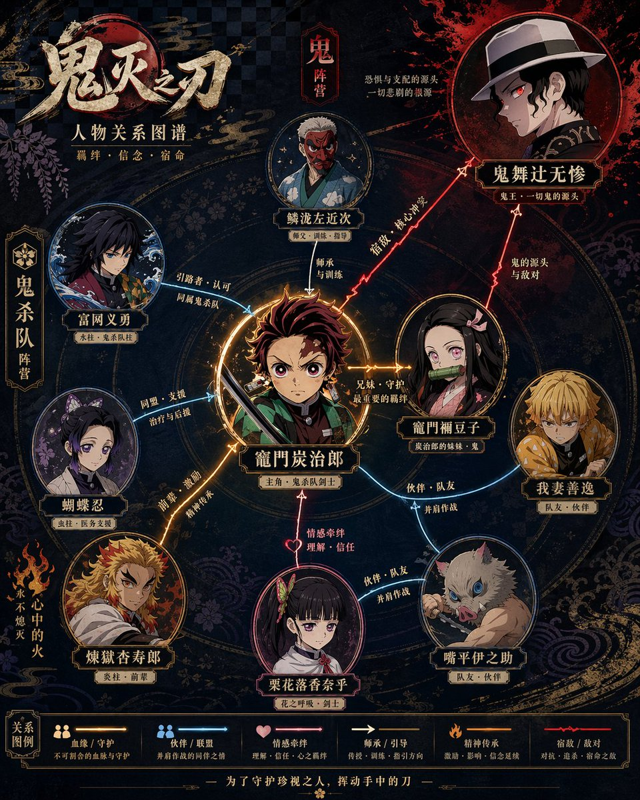 |  |
|  |  |

**Prompt**
```text
generate a high-design character relationship map poster based on {argument name="theme" default="Demon Slayer"}. This image should not be a simple illustration, but a character relationship map that combines information visualization, narrative structure, poster design sense, and stylistic fidelity.

Please automatically complete the following:
- Identify the work and core settings corresponding to the theme
- Extract the most representative 6–12 key characters, not exceeding 15 if necessary
- Identify and display key character relationships, including blood ties, romance, friendship, alliances, hostility, master-disciple, etc.
- Automatically choose a composition method based on the work's characteristics, such as protagonist-centered, dual-core confrontation, faction-based, family tree, or chronological evolution
- Automatically refine the work's style DNA, including color, worldview symbols, textures, mood, typography, and representative elements
- Transform these stylistic elements into an overall visual design for the relationship map, rather than simply copying an official poster
- Use different colors, line types, and arrows to distinguish different relationships, ensuring clear lines and layers without clutter
- Make core characters most prominent, followed by important characters, and subordinate characters weakened to form a clear visual hierarchy
- Ensure every character name is legible, with identity or faction labels if necessary

The final product should satisfy:
- Immediate understanding of character hierarchy and key relationships
- Obvious alignment with the original work's temperament and setting
- Combines the clarity of an infographic with the premium design of a poster
- Unified, exquisite, complete, and suitable for social media sharing or poster display
- Avoids a cheap flowchart feel, messy piling, and information overload.
```

### No. 3: Automatically generate a high-aesthetic "Silhouette Universe / Collector's Editi...
  

- Category: **UI, App & Dashboard**
- Source: [Tweet](https://x.com/MrLarus/status/2046627021674168640)
| Preview 1 | Preview 2 |
|---|---|
|  | 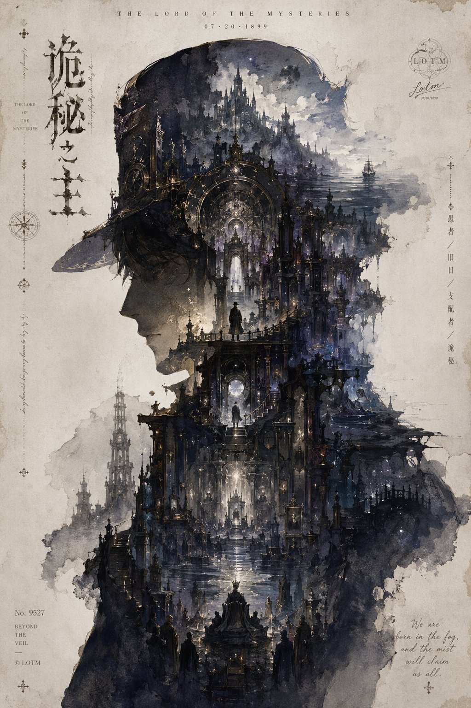 |
| 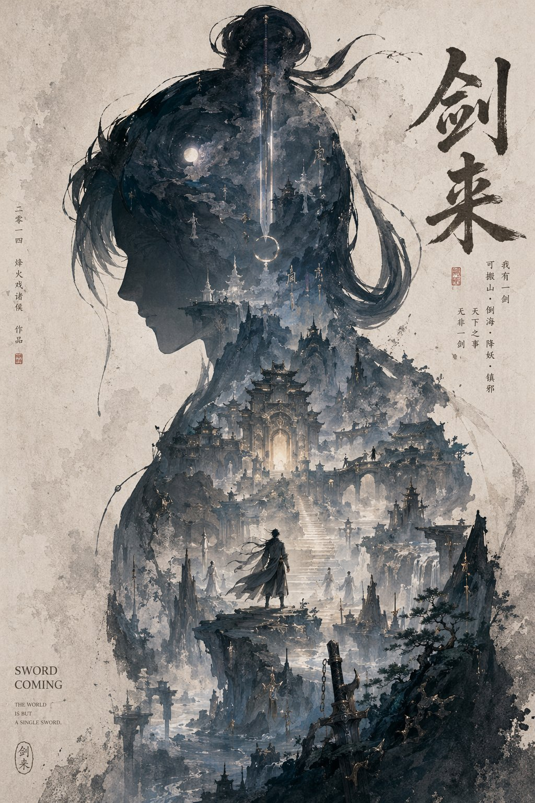 | 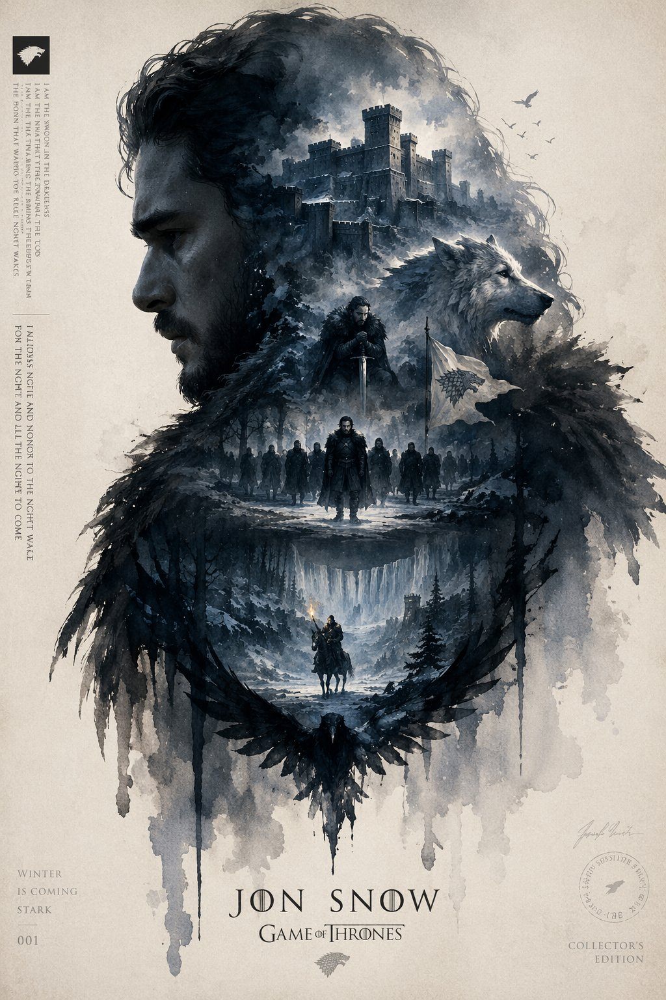 |

**Prompt**
```text
generate a high-aesthetic "Silhouette Universe / Collector's Edition Narrative Poster" based on [theme: xxx]. Do not default to common containers such as bottles, hourglasses, glass domes, or pocket watches. Instead, let the AI choose the most symbolic, visually strong, and narratively suitable outer silhouette for the theme. The silhouette can be an artifact, building, gate, tower, archway, dome, stairwell, corridor, statue, profile, eye, hand, skull, wing, mask, mirror, throne, ring, crack, light curtain, shadow, geometric form, spatial cross-section, stage frame, abstract symbol, or any more creative contour that best represents the theme.

The goal is not to simply place a world inside an object, but to make the entire themed universe grow naturally within, around, and through the silhouette itself. The silhouette should be elegant, recognizable, and compositionally dominant. Inside or along its boundary, generate a rich and layered narrative world strongly tied to the theme, including iconic scenes, key architecture or spaces, symbols and metaphors, traces of characters or civilizations, foreground-midground-background depth, and atmosphere with emotional tension. Elements such as doors, staircases, bridges, water, smoke, paths, light sources, ruins, mechanical structures, landscapes, abstract forms, creatures, or props should all feel unified and organically integrated rather than pasted together.

The final composition should feel like a premium collector's poster with strong design value. The large shapes should feel stable, the main silhouette should be unmistakable, and the inner world should have depth, structure, and breathing room. Details should be rich but not crowded. You may add small human silhouettes, distant buildings, beams of light, doorways, bridges, steps, corridors, reflections, skylight, or far-background structures to enhance scale, story, and epic atmosphere. The overall mood should be quiet, grand, refined, and lingering rather than noisy or overloaded.

Blend the feeling of a collector's edition film poster, high-end narrative visual design, dreamy watercolor texture, and fine printed paper. Emphasize paper grain, feathered edges, watercolor brush marks, gentle diffusion, atmospheric perspective, soft haze, selective volumetric light, light passing through mist, generous negative space, and restrained layout. The image should feel premium, poetic, majestic, sacred, nostalgic, quiet, and mythic.

Let the AI choose an elevated color palette based on the theme, but keep it unified, restrained, tasteful, low-saturation, and premium. Avoid chaotic high saturation, cheap neon effects, or plastic digital color. Suitable palette families may include black-gold-gray, cool blue-gray, mist white-gray, brown-red with off-white, dark copper, aged paper tones, deep sea blue, twilight purple, or silver-gray, as long as they serve the theme.

Final requirement: the first glance should give strong theme recognition and a memorable silhouette, the second glance should reveal a complete narrative world, and the third glance should still reward close inspection with depth and aftertaste. Avoid generic backgrounds, hard cut-and-paste compositions, templated fantasy assets, video-game promo art vibes, excessive cartooning, or realism that kills the artistic mood. If appropriate, subtle titles, numbering, signatures, or marks can be added as part of the poster design, but they must never overpower the image.
```

### No. 4: Please generate a high-quality vertical "Popular Science Encyclopedia Image" bas...
  

- Category: **Maps, Cards & Structured Layouts**
- Source: [Tweet](https://x.com/alanlovelq/status/2046378199681257920)
| Preview 1 | Preview 2 |
|---|---|
|  |  |
|  |  |

**Prompt**
```text
generate a high-quality vertical "Popular Science Encyclopedia Image" based on {argument name="theme" default="animals"}.

This image is not a regular poster or a simple illustration, but a modular popular science infographic that possesses a sense of "illustration book, encyclopedia, information structure, and collectability." The overall style should reference a combination of high-end natural history illustrations, modern encyclopedia pages, lifestyle knowledge cards, and highly shareable social media infographics.

Please include in the frame:
- A clear and beautiful main visual of the subject
- Several magnified details of local characteristics
- Multiple rounded modular information sections
- Clear title hierarchies and key labels
- Concise yet rich encyclopedic content
- Visual ratings, key point summaries, or Top 5 modules

Content columns should be automatically adapted based on the theme, prioritized from these directions: basic profile, classification information, appearance characteristics, habits/ecology, formation mechanism/structure, growth or use conditions, care or maintenance suggestions, risks and precautions, suitable audience or scenarios, pros and cons comparison, and quick rating cards.

Visual requirements:
Light-colored clean background, soft color palette, light shadows, exquisite small icons, rounded information boxes, neat layout, high information density but not crowded, good reading experience. The overall result must look like a real science encyclopedia card suitable for publishing, reading, collecting, and serialized production, rather than an advertisement.

Please do not make it a regular commercial promotional poster. Highlight the features of "knowledge organization + modular information + illustration-style display."
```

### No. 5: Generate a Chinese fitness infographic for [topic].
  

- Category: **Maps, Cards & Structured Layouts**
- Source: [Tweet](https://x.com/MrLarus/status/2046627021674168640)
| Preview 1 | Preview 2 |
|---|---|
| 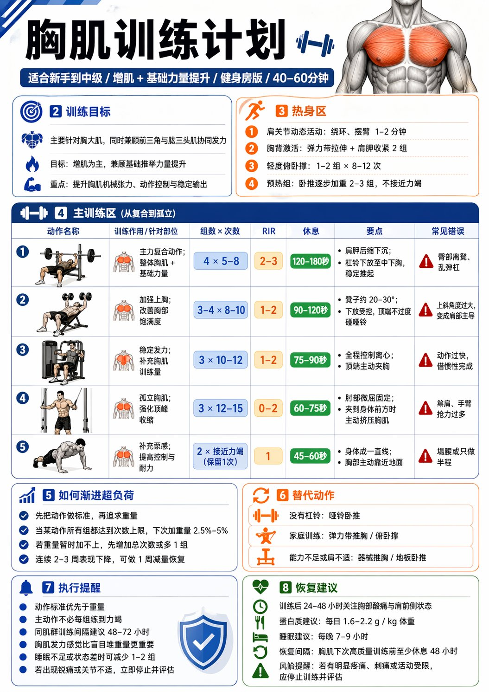 | 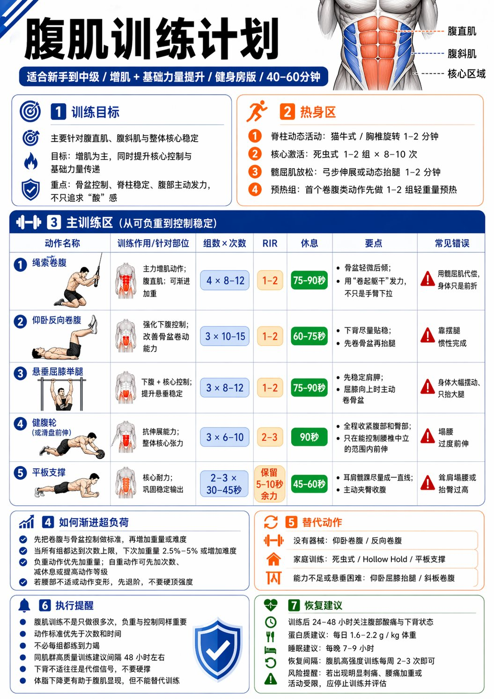 |
| 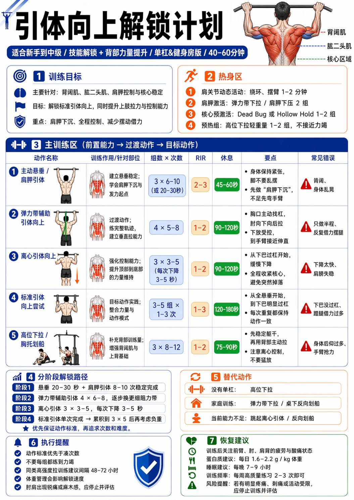 | 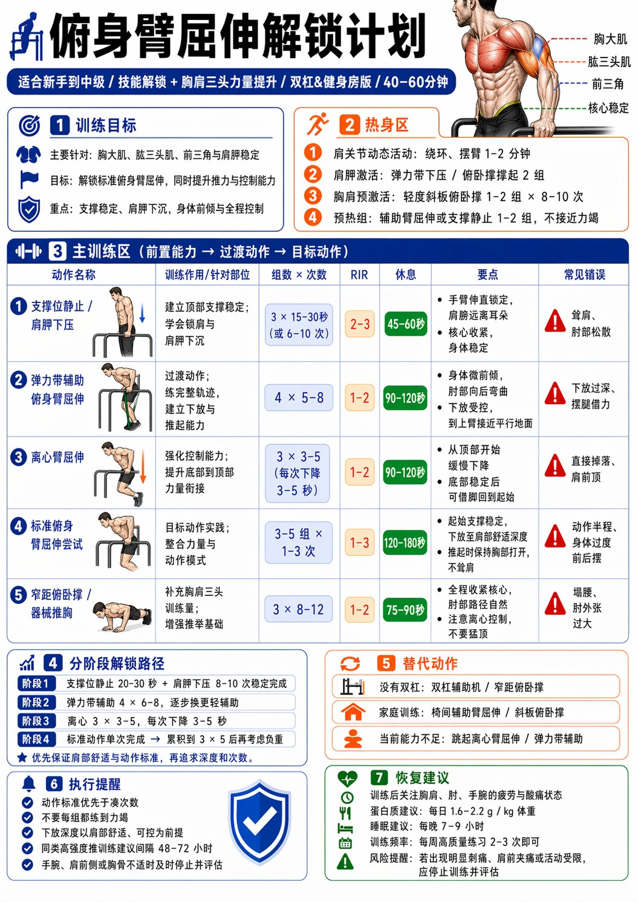 |

**Prompt**
```text
Generate a Chinese fitness infographic for [topic].

The graphic should be both professional and practical for a normal adult to use as a training reference. Unless otherwise specified, assume the audience is a healthy adult with no major injuries, the goal is muscle gain plus basic strength improvement, the level is beginner to intermediate, the setting is a normal gym, and the total session length should stay within 40 to 60 minutes.

Choose the output format automatically based on the training topic:

1. If the topic is a muscle group or body part, such as chest, lats, biceps, abs, shoulders, or legs, generate a training-plan infographic for that body part.
2. If the topic is an exercise or skill goal, such as pull-up, push-up, dips, or squat, generate an exercise-unlock or progression-plan infographic.

Use a clear, modern, professional, easy-to-read Chinese infographic style in vertical format. The visual design should be clean and suitable for social sharing or personal training reference. Do not write long paragraphs. Each module should use short concise phrases, and numerical information should be prominent.

The infographic must include:
A. Title area with main title and subtitle
B. Training goal area
C. Warm-up area
D. Main training area with 4 to 6 core exercises
E. Progression or unlock logic area
F. Alternative exercises area
G. Execution reminders area
H. Recovery suggestions area
I. Visual design requirements: modern, clean, professional, modular card layout

The final result should be a complete infographic rather than plain text paragraphs.
```

### No. 6: {"type": "YouTube desktop dark mode UI mockup", "header": {"logo": "YouTube", "s...
   

- Category: **UI, App & Dashboard**
- Source: [Tweet](https://x.com/tehno_maniak/status/2044754985183785208#reversed-1)
| Preview 1 | Preview 2 |
|---|---|
|  |  |
|  |  |

**Prompt**
```text
{"type": "YouTube desktop dark mode UI mockup", "header": {"logo": "YouTube", "search_bar": "Search", "icons_count": 5, "icons": ["search", "mic", "create", "notifications", "profile"]}, "video_player": {"top_left_badge": "LIVE", "left_side": {"subject": "{argument name=\"presenter description\" default=\"man in green sweater at wooden podium\"}", "podium_logo": "OpenAI"}, "right_side_presentation": {"text_elements": ["OpenAI", "INTRODUCING", "{argument name=\"product name\" default=\"GPT-Image-2\"}", "{argument name=\"tagline\" default=\"More Realistic. More Useful. More Creative.\"}"], "sample_images_count": 4, "sample_images": ["mountain lake with boat", "woman portrait with dappled light", "cute robot with lantern in forest", "starry night cafe painting"]}, "bottom_controls_count": 10, "bottom_controls": ["pause", "next", "volume", "LIVE", "red progress bar", "CC", "settings", "miniplayer", "theater mode", "fullscreen"]}, "video_details": {"title": "{argument name=\"video title\" default=\"OpenAI Live: Introducing GPT-Image-2\"}", "channel": {"name": "{argument name=\"channel name\" default=\"OpenAI\"}", "verified": true, "subscribers": "1.36M", "button": "Subscribe"}, "action_buttons_count": 5, "action_buttons": ["Like 12K", "Dislike 497", "Share", "Save", "More"], "description_box": {"stats": "95,237 watching now Started streaming 7 minutes ago", "tags": "#OpenAI #GPTImage2 #AI", "text": "Join us for a special live event as we introduce GPT-Image-2, our latest and most advanced image generation model. See new capabilities, live demos, and hear from the team ...more"}}}
```

## All Categories

## Portrait & Photography

31 prompt examples in this category.  
[Open doc](docs/portrait-photography.md)


| Preview |
|---|
| 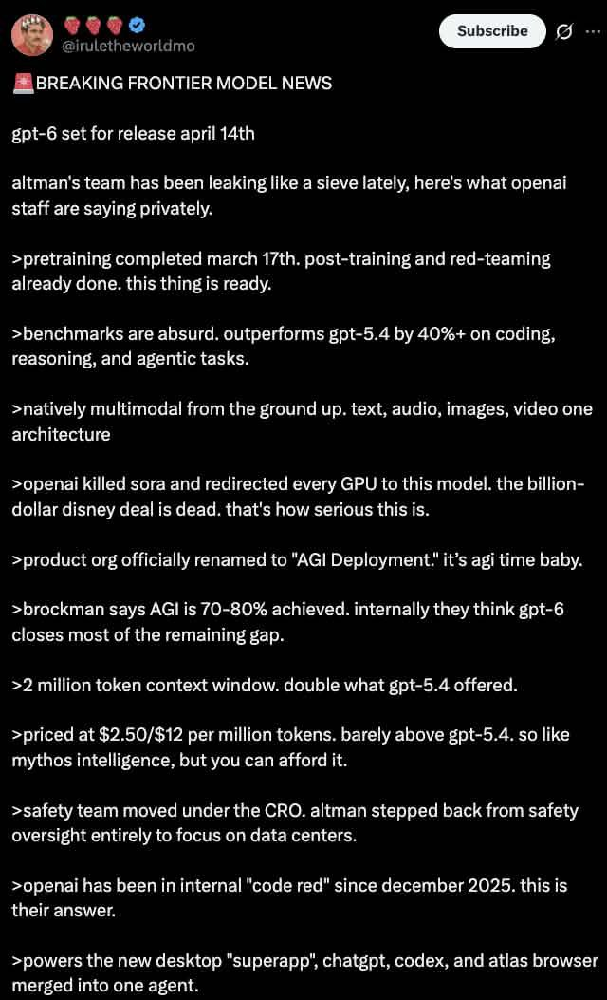 |

Source: [Tweet](https://twitter.com/dihsclusive/status/2045905067845271555)  
Title: **🚨NEW GPT IMAGE 2 UPDATE ‼️**  
**Prompt**
```text
“Generate an X tweet from a professional openai fanfiction writer”
```

 
| Preview |
|---|
|  |

Source: [Tweet](https://twitter.com/Tz_2022/status/2045892003775361198)  
Title: **gpt-image-2 的复杂提示词准确性测试**  
**Prompt**
```text
如下：

该画面为中近景，采用平视镜头，聚焦于一位年轻女性。她以七分身镜头呈现，身体坐姿略带倾斜，臀部向后撅起，双腿自然交叠，左腿在前，右腿在后，膝盖微屈。她将上半身向右后方扭转，头部则转向镜头方向，形成一个经典的“回眸”姿态，目光直视镜头，眼神清澈而略带一丝俏皮。她的发型是蓬松的棕色齐肩短发，刘海自然垂落，发尾微卷，妆容清淡自然，仅在眼部有轻微眼线勾勒，唇色为自然裸粉。画面整体采用自然日光滤镜，光线从画面左上方斜射入，形成柔和的逆光轮廓，面部和身体右侧被温暖的金色光线照亮，左侧则形成自然的阴影过渡，增强了立体感。灯光效果是明亮的自然光，带有轻微的镜头眩光，营造出午后阳光的氛围。拍摄角度为平视，构图上，人物主体位于画面中偏右位置，背景中的斑马线与道路线条形成自然的引导线，将视线引向人物。背景为城市街道，包含道路、斑马线、绿化带和远处的车辆，背景被适度虚化，但依然可辨识出树木、护栏和停放的电动车等元素，构图上利用了三分法，人物位于右侧三分之一处，增强了画面的平衡感。主体穿着一件军绿色迷彩图案的连帽卫衣，下身搭配黑色短裤，脚穿白色高帮运动鞋配白色中筒袜。背包为黑色，带有橙黄色装饰条纹和一个橙色毛绒挂件，材质为帆布和皮革拼接。整体风格为街头休闲风，肢体语言放松自然，表情略带好奇与俏皮，整体呈现出一种随性、青春、充满活力的都市少女形象。
```

 
| Preview |
|---|
|  |

Source: [Tweet](https://x.com/BubbleBrain/status/2045167461147042202)  
Title: **35mm film photography with harsh convenience store fluorescent lighting mixed wi...**  
**Prompt**
```text
35mm film photography with harsh convenience store fluorescent lighting mixed with colorful neon signs from outside, authentic film grain, high contrast, slight color cast, cinematic street editorial style, intimate medium shot, early 20s sexy Chinese female idol with ultra-realistic delicate refined Chinese features, seductive almond-shaped fox eyes with natural double eyelids, high nose bridge, small sharp V-shaped jawline, flawless porcelain skin with cool ivory undertone and visible specular highlights from fluorescent light, subtle skin texture and micro pores, natural dewy makeup with soft flush on cheeks, glossy natural pink lips slightly parted, subtle natural freckles across nose and cheeks, long dark brown hair in a messy high ponytail with many loose strands falling around face and neck, wearing an oversized white button-up shirt as the only top, unbuttoned at the top with deep cleavage and loosely tied at the waist, paired with a tiny black pleated mini skirt, barefoot in simple white slides, seductive casual leaning pose against the glass door of a 24-hour convenience store at late night, body slightly arched, one leg bent with foot resting against the door frame, the other leg straight, one hand holding a bottle of iced drink, the other hand lightly pulling the hem of her mini skirt, intensely seductive playful yet slightly vulnerable gaze straight at the viewer with soft doe eyes full of quiet temptation and teasing smile, bright cold fluorescent store light from inside mixed with pink and blue neon glow from outside signs, realistic reflections on glass door, blurred convenience store interior with shelves and snacks in background, authentic 35mm film color grading with harsh lighting and neon accents, extremely sharp yet soft skin rendering, natural hair strands, realistic fabric wrinkles and drape on the oversized shirt and mini skirt, no plastic skin, no digital over-sharpening, no airbrushing, no blemishes, no moles, no oily skin, no watermark, no text, authentic late-night convenience store atmosphere
```


| Preview |
|---|
| 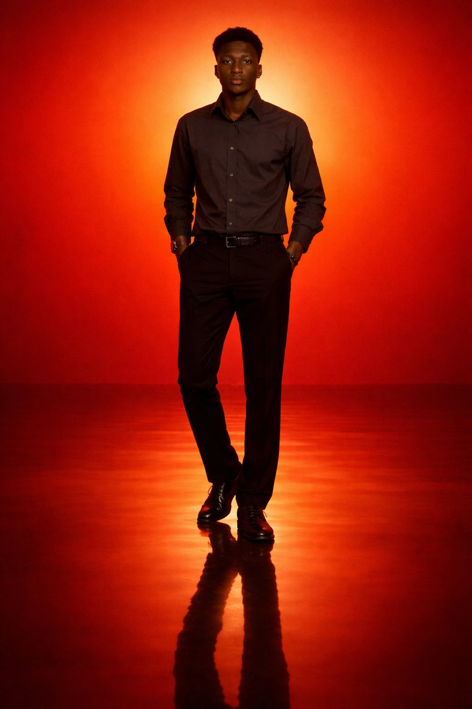 |

Source: [Tweet](https://x.com/iam_miharbi/status/2045151354679665101)  
Title: **Generate a cinematic minimal portrait of a solitary man standing in an intense o...**  
**Prompt**
```text
Generate a cinematic minimal portrait of a solitary man standing in an intense orange to red gradient environment, strong silhouette lighting, deep shadow contrast, reflective glossy floor, symmetrical composition, minimal
```

 
| Preview |
|---|
|  |

Source: [Tweet](https://x.com/BubbleBrain/status/2045092449803284923)  
Title: **35mm film photography, warm vintage Japanese onsen ryokan aesthetic, soft ambien...**  
**Prompt**
```text
35mm film photography, warm vintage Japanese onsen ryokan aesthetic, soft ambient wooden lantern lighting mixed with gentle natural window light, subtle film grain, gentle color shift, high atmosphere editorial style, intimate medium shot, early 20s beautiful Chinese female idol with ultra-realistic delicate refined Chinese features, seductive almond-shaped fox eyes with natural double eyelids, high nose bridge, small sharp V-shaped jawline, flawless porcelain skin with warm ivory undertone, visible subtle skin texture and micro pores, soft natural makeup with dewy glow, subtle rosy flush on cheeks, natural soft pink lips slightly parted, long dark brown hair tied in a loose low bun with some messy strands falling around face and neck, wearing a loose white yukata (traditional Japanese bathrobe) deliberately slipped off one shoulder and loosely tied at the waist, the fabric slightly open revealing smooth skin and subtle cleavage, barefoot, seductive relaxed sitting pose on the edge of a traditional wooden engawa veranda at a vintage onsen ryokan, body slightly turned toward the camera, one leg bent with foot resting on the wooden floor, the other leg gently dangling, one hand lightly holding the yukata collar, the other hand resting on the wooden floor behind her for support, softly arched back to gently accentuate curves, intensely seductive yet gentle and inviting gaze straight at the viewer with soft doe eyes full of quiet temptation and warmth, warm wooden interior with paper sliding doors and distant steaming hot spring in soft focus, gentle rim lighting highlighting skin and fabric texture, authentic vintage film color grading with warm tones, extremely sharp yet soft skin rendering, natural hair strands, realistic fabric wrinkles and drape on the yukata, no plastic skin, no digital over-sharpening, no airbrushing, no blemishes, no moles, no oily skin, no watermark, no text, authentic 35mm film Japanese onsen ryokan atmosphere
```

 
| Preview |
|---|
|  |

Source: [Tweet](https://x.com/BubbleBrain/status/2045052982728016131)  
Title: **35mm color film photography with harsh direct on-camera flash, specular highligh...**  
**Prompt**
```text
35mm color film photography with harsh direct on-camera flash, specular highlights on skin and clothing, strong catchlights in eyes, high contrast flash illumination, authentic film grain and color shift, high fashion fresh innocent basketball court editorial style, intimate first-person low-angle POV shot from below, early 20s sexy Chinese female idol with ultra-realistic delicate refined Chinese features, seductive almond-shaped fox eyes with natural double eyelids, high nose bridge, small sharp V-shaped jawline, flawless realistic porcelain skin with cool ivory undertone and visible flash specular highlights, fine delicate skin texture with subtle pores micro details and natural dewy glow under flash, fresh natural sporty makeup with soft dewy glow, subtle natural flush on cheeks, natural pink lips slightly parted, subtle natural freckles across nose and cheeks, long dark brown hair tied in a high playful ponytail with some loose strands framing the face and realistic loose strands, wearing a loose white tank top and white high-waisted basketball shorts, white knee-high sports socks, seductive natural leaning pose against the basketball hoop pole on the outdoor court at dusk, body angled sideways with naturally arched back and hips gently pushed back to accentuate perky round hips and sexy butt curve, one leg naturally extended forward toward the camera and the other leg slightly bent to emphasize long sexy legs, both hands lightly resting on the basketball pole at shoulder height, intensely seductive playful yet pitiable doe-eyed gaze straight at the viewer with soft vulnerable longing eyes and a gentle teasing smile full of quiet temptation and desire, harsh direct on-camera flash creating sharp specular highlights and strong catchlights, background with blurred basketball court and hoop under dusk sky, high contrast film color grading with natural flash look, extremely sharp yet soft skin rendering with authentic 35mm direct flash aesthetic, natural hair strands, realistic fabric texture on tank top and shorts with socks detail, no plastic skin, no digital over-sharpening, no airbrushing, no blemishes, no moles, no oily skin, no watermark, no text, authentic 35mm direct flash film basketball court look --ar 9:16
```


| Preview |
|---|
|  |

Source: [Tweet](https://x.com/Shinning1010/status/2045002808903020962)  
Title: **A stunning 18-year-old Chinese girl with a youthful, pure face and realistic ski...**  
**Prompt**
```text
Negative Prompts: no extra limbs, no deformed hands, no blur, no noise, no watermark, no text, no cartoon/anime style. Aspect Ratio: 3:4.
```

 
| Preview |
|---|
|  |

Source: [Tweet](https://x.com/BubbleBrain/status/2046115431144902732)  
Title: **Analog 35mm film photography, soft airy Japanese-style aesthetic, gentle diffuse...**  
**Prompt**
```text
Analog 35mm film photography, soft airy Japanese-style aesthetic, gentle diffused natural window light, slight overexposure, pastel tones, low contrast, soft highlights, minimal indoor setting near a window with white curtains, clean light-colored wall, natural composition, eye-level, slightly closer full-body framing (mid-thigh to head), young East Asian woman, natural minimal makeup, soft realistic skin texture, long slightly messy dark hair, oversized white button-up shirt, light casual shorts, barefoot, simple and relaxed styling, standing naturally with relaxed posture, arms loosely at sides or slightly behind, facing camera, gentle soft smile, subtle stillness, focus on light, air, and quiet everyday mood, soft film grain, dreamy and understated atmosphere --ar 9:16
```

 
| Preview |
|---|
|  |

Source: [Tweet](https://x.com/BubbleBrain/status/2046151898621993364)  
Title: **9:16 vertical — a 3x3 grid collage (nine images) forming a Korean idol portrait ...**  
**Prompt**
```text
9:16 vertical — a 3x3 grid collage (nine images) forming a Korean idol portrait photoshoot series. Each frame features the same young Korean female idol, maintaining 100% consistency in facial features, proportions, hairstyle, and identity across all nine shots.   Natural, ultra-realistic skin texture, no retouching, no smoothing. Clean idol-style minimal makeup, soft glow, subtle imperfections.   Hair: long, voluminous dark hair, slightly tousled, consistent across all frames (natural loose flow, slight movement).  Outfit: cohesive Korean idol photoshoot styling — white shirt + short bottoms (or simple neutral-toned outfit), youthful, clean, slightly casual but styled. Same outfit across all frames.  Setting: minimal studio or simple indoor environment (plain wall, soft window light, clean background). Focus on subject, not environment.  Lighting: soft diffused natural light, gentle highlights, low contrast, slightly airy tones, subtle film-like softness.  Camera style: intimate portrait photography, slightly handheld feel, subtle imperfections (minor grain, slight blur in motion frames, imperfect framing).  Frame breakdown (3x3 grid):  Top row: - Top left: standing naturally, looking slightly away, relaxed expression - Top center: facing camera, casual mid-motion (hair or body slight movement) - Top right: slight side angle, soft gaze, natural candid feel  Middle row: - Center left: looking slightly upward, soft thoughtful expression - Center: close-up portrait, direct eye contact, gentle idol smile - Center right: turning body slightly, mid-motion candid frame  Bottom row: - Bottom left: seated or leaning casually, relaxed posture - Bottom center: back partially turned, looking over shoulder toward camera - Bottom right: standing close to frame, slightly playful or soft expression  Mood: Korean idol photobook / photocard aesthetic, intimate, soft, natural, everyday charm.  Quality: ultra-realistic, 8K detail, subtle analog film grain, natural imperfections, soft dreamy tone
```

 
| Preview |
|---|
|  |

Source: [Tweet](https://x.com/BubbleBrain/status/2046434670724907395)  
Title: **9:16 vertical — editorial portrait, single subject soft black mist filter, subtl...**  
**Prompt**
```text
9:16 vertical — editorial portrait, single subject  soft black mist filter, subtle haze, gentle highlight bloom, muted tones  minimal indoor space, clean background, slight texture  young Korean woman, minimal makeup, natural skin texture  outfit: fitted ribbed knit top or soft camisole layered under a loose shirt, paired with high-waisted shorts or skirt; fabric slightly clings to body shape, soft and natural, no revealing elements  hair: slightly messy, natural volume  pose: sitting on floor with one leg bent and the other relaxed, body slightly leaning, shoulders not aligned, head tilted  composition: subject slightly off-center, negative space present  expression: calm, slightly distant, natural lips  lighting: soft side light, gentle shadow falloff  mood: understated, quiet, subtly sensual through natural body lines, relaxed and unposed  quality: fine grain, slight softness, realistic look
```

 
| Preview |
|---|
|  |

Source: [Tweet](https://x.com/BubbleBrain/status/2046483268019884384)  
Title: **9:16 vertical — Japanese Fuji film style portrait, single subject Fujifilm analo...**  
**Prompt**
```text
9:16 vertical — Japanese Fuji film style portrait, single subject  Fujifilm analog aesthetic (Pro 400H / Superia feel), soft pastel tones, slight green-magenta shift, low contrast, gentle highlight roll-off, fine film grain, subtle halation, slight vignette  bright natural daylight, diffused sunlight through window, soft shadows, airy atmosphere  young Japanese female idol, natural minimal makeup, fresh glowing skin, realistic texture, slight imperfections  outfit: Japanese school uniform (sailor-style or blazer uniform), neatly styled, non-revealing, youthful and clean  hair: natural dark hair, straight or softly flowing, a few loose strands  pose: front-facing or slight angle toward camera, relaxed posture; one hand gently holding a strawberry near lips, mid-action as if about to take a bite; shoulders relaxed, subtle natural body curve  expression: soft playful gaze, light smile or neutral lips, gentle eye contact with camera  setting: minimal indoor near window or simple outdoor corner, clean background, everyday atmosphere  composition: slightly off-center framing, intimate distance, candid feel  mood: fresh, youthful, sweet everyday moment, understated charm  quality: ultra-realistic, analog film look, natural imperfections, soft dreamy finish
```

 
| Preview |
|---|
|  |

Source: [Tweet](https://x.com/BubbleBrain/status/2046518189509734903)  
Title: **9:16 vertical — Korean idol portrait photography, single subject soft black mist...**  
**Prompt**
```text
9:16 vertical — Korean idol portrait photography, single subject  soft black mist filter effect, lowered contrast, gentle highlight bloom, subtle glow, soft diffusion, slightly faded blacks  minimal indoor setting near window, white curtains, clean light-toned background  young Korean female idol, natural minimal makeup, dewy realistic skin texture, subtle imperfections  outfit: oversized white button-up shirt + short bottoms, slightly loose fit, soft and casual styling, no revealing elements  hair: long dark hair, slightly messy, natural volume, softly flowing  pose: relaxed standing or slight lean, body subtly angled, one leg slightly forward, shoulders relaxed; one hand lightly touching collar or resting near neckline, the other relaxed; gentle body curve without exaggeration  expression: soft cute smile, slightly playful eyes, direct or slightly off-camera gaze  camera: close to mid-body framing, eye-level, intimate distance, slight handheld feel  lighting: diffused natural daylight, soft shadows, gentle light wrapping around face and body  mood: cute yet subtly sensual, intimate, everyday softness, quiet romantic atmosphere  quality: ultra-realistic, fine film grain, slight softness at edges, natural imperfections, dreamy understated tone
```

_More in [docs/portrait-photography.md](docs/portrait-photography.md)._

## Cinematic & Film Still

2 prompt examples in this category.  
[Open doc](docs/cinematic-film-still.md)

  
| Preview 1 | Preview 2 |
|---|---|
| 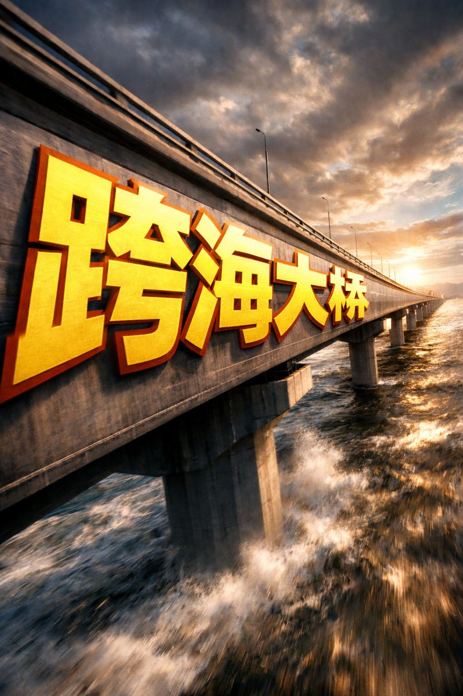 | 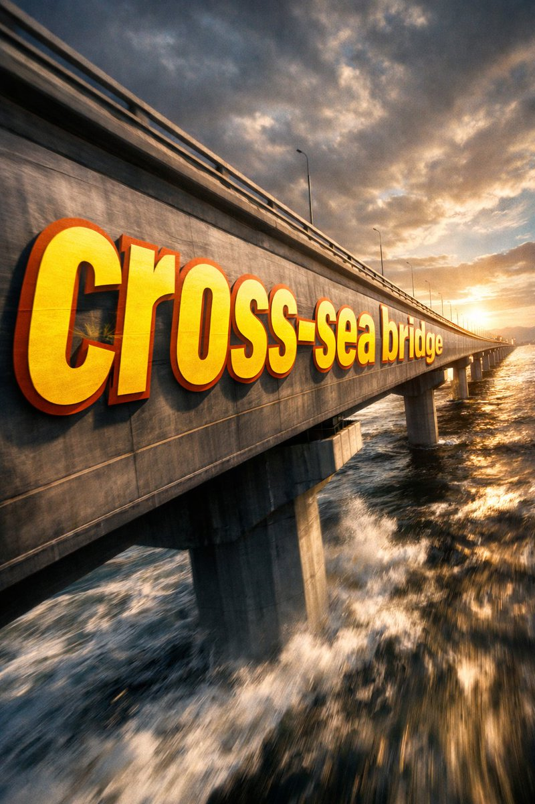 |

Source: [Tweet](https://twitter.com/xpg0970/status/2045560665071579160)  
Title: **GPT-image 2 完美胜任这种3D立体远透视文字效果**  
**Prompt**
```text
①场景 跨海大桥的侧面，dramatic cinematic angle。 巨型 bold sans-serif 文字「___②文字内容 跨海大桥」painted onto the surface of ___③主体物 无，从靠近镜头的前端开始，沿表面向远端 progressively foreshortens 逐渐透视压缩，letterforms conform to surface curvature 贴合物体曲面，surface-integrated not floating。 文字部分区域被 无___④前景遮挡物 无___ occluded and hidden，在间隙中露出， 形成 depth-layering 纵深穿插效果。 Oversized bright yellow + sharp orange outline，extreme perspective distortion aligned to vanishing point。Cinematic lighting, motion blur, poster-grade dynamic integrated typography, modern advertising aesthetics。
```


| Preview |
|---|
| 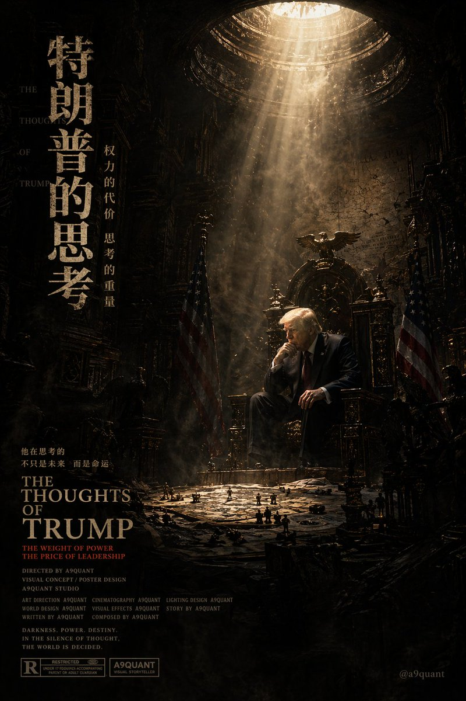 |

Source: [Tweet](https://x.com/A9Quant/status/2046224777208361126)  
Title: **围绕【主题】自动生成一张顶级暗黑史诗概念海报 / 电影感信息图海报。**  
**Prompt**
```text
- 如果【主题】偏暗黑英雄、复仇、正义、孤独、宿命,则自动偏向石质王座、孤高人物、冷色神光、废墟或洞穴感空间
- 如果【主题】偏神秘、幽灵、潜行、幻影、夜行,则自动偏向月光、迷雾、冷蓝色体积光、深渊式黑暗空间
- 如果【主题】偏权力、统治、王者、秩序,则自动强化 throne / altar / crown-like symbol / ritual space 的表达
- 如果【主题】偏科技、AI、未来、机械,则自动将王座和空间替换为机械神座、能量基座、金属洞窟、工业神殿等未来化形态
- 如果【主题】偏产品、品牌、器物,则自动把核心主体替换为最合适的 hero object,并保留被神光审判式凸显的史诗构图
- 若主题更适合中文,则优先中文;若更适合英文,则自动英文;也可双语,但必须统一
```

## Poster & Flyer

12 prompt examples in this category.  
[Open doc](docs/poster-flyer.md)

 
| Preview |
|---|
|  |

Source: [Tweet](https://twitter.com/liyue_ai/status/2045873940883808523)  
Title: **gpt image 2生成城市印象创意海报。**  
**Prompt**
```text
【背景与骨架线条】
纯黑深邃底色，一条粗壮有力的墨色书法S型曲线自画面一端蜿蜒贯穿至另一端，笔触苍劲，墨迹浓淡有致，如大写意行笔，构成整幅画面的视觉骨架与叙事动线。
【主体：透明燕子】
曲线上方，一只展翅飞翔的画眉鸟占据视觉核心；身体呈玻璃透明质感，内部映射传统建筑群叠影，蓝绿色光流在透明羽翼间流转折射，仿佛时间长河与文明记忆凝缩其中；轮廓以极细金线勾边，增强立体感与神圣感。
【中景：古典建筑序列】
燕子下方，沿墨线曲线错落分布广州的各种风景名胜：白云山、陈家祠、双子塔、广州塔、猎德大桥、海珠塔依次浮现；主色调青绿与淡金，建筑细节清晰，琉璃瓦、飞檐翘角、石阶回廊；木棉花簇拥点缀于建筑周围，花瓣随风轻散，静谧而悠远；几朵水墨云朵轻盈飘浮其间，增添空灵层次。
【前景：白鹤与水面】
前景湖畔：数只白鹤或静立水边、或振翅腾飞，姿态各异，优雅从容；浅蓝湖面如镜，倒影荡漾，波光细碎，营造宁静氛围。
【远景：山峦】
远处山峦层叠起伏，青黛色晕染，墨色由浓至淡，朦胧氤氲，富有水墨层次；与前景形成近实远虚的空间纵深。
【构图与光影】
非线性透视构图，墨线曲线为叙事主轴，古今元素沿线嵌入；光源自画面中心向外辐射扩散，形成强烈明暗对比，中心亮、四周渐暗；冷色调主导（深蓝、青绿、银白），暖色点缀（樱花粉、淡金），和谐而神秘；东方美学与现代意象交融，超现实诗意意境。
【技术规格】
8K超高清渲染，极致细节精度，最佳画质，比例 9:16
```


| Preview |
|---|
|  |

Source: [Tweet](https://twitter.com/liyue_ai/status/2045527750606487877)  
Title: **gpt image 2生成城市剪纸艺术海报。**  
**Prompt**
```text
以珠江新城现代都市景观为灵感的剪纸艺术，通过精巧的镂空手法在一整幅纸上，立体刻画广州塔、东西双塔等地标建筑与繁华城景。
所有建筑与元素均以流畅的线条与结构相连，无孤立部分，构成一幅完整的都市画卷。
画面采用金属箔或光泽纸材质，表面带有细腻的明暗光泽，在光照下呈现柔和的高光与阴影，仿佛被城市灯光轻轻照亮。
背景以虚化的珠江新城天际线为衬，点缀隐约可见的花城广场与树木轮廓，整体透出现代浪漫的氛围。
作品中巧妙融入轻盈的蒲公英绒毛或星光般的动态光点，象征梦想与活力在这座新城中飘散飞扬。整体呈现8K超高清视觉，细节丰富，真实而富有艺术感染力。
```


| Preview |
|---|
|  |

Source: [Tweet](https://twitter.com/liyue_ai/status/2045506567735558336)  
Title: **gpt image 2生成东风美学海报：穷奇。**  
**Prompt**
```text
极简主义，新中式风格立体图形设计，图像下端有楷体中国文字：“东方美学”，“2026/04/18”，署名 “CHINA”，和“@LIYUE"；
平整纯白色的亚光质感厚艺术纸上绘充满东方诗意氛围的山水创意画，不规则的撕纸效果；
中国的神兽：穷奇，身形图案完整，美轮美奂，，线条柔美灵动,眼睛炯炯有神，威严的神态，优雅的姿势，奢华装饰艺术，中国传统纹饰；
荧光蓝色线条，0.5mm极细金色金属质感勾边，泼白墨大笔触，色彩渲染，红底，蓝色的浪漫诗意视觉；
冷暖光交织的梦幻唯美场景，强烈的光影对比氛围，花轻舞的时光叙事，东风禅意，画面有大面积留白，框架构图，底部留白，细节清晰。
```

 
| Preview |
|---|
|  |

Source: [Tweet](https://twitter.com/MrLarus/status/2045504669401653414)  
Title: **GPT-image-2 生成汉服拆解图🤯图鉴式风格，拆的很细！**  
**Prompt**
```text
请根据【主题】自动生成一张“博物馆图鉴式中文拆解信息图”。

要求整张图兼具真实写实主视觉、结构拆解、中文标注、材质说明、纹样寓意、色彩含义和核心特征总结。你需要根据【主题】自动判断最合适的主体对象、服饰体系、器物结构、时代风格、关键部件、材质工艺、颜色方案与版式结构，用户无需再提供其他信息。

整体风格应为：国家博物馆展板、历史服饰图鉴、文博专题信息图，而不是普通海报、古风写真、电商详情页或动漫插画。背景采用米白、绢纸白、浅茶色等纸张质感，整体高级、克制、专业、可收藏。

版式固定为：
- 顶部：中文主标题 + 副标题 + 导语
- 左侧：结构拆解区，中文引线标注关键部件，并配局部特写
- 右上：材质 / 工艺 / 质感区，展示真实纹理小样并附说明
- 右中：纹样 / 色彩 / 寓意区，展示主色板、纹样样本和文化解释
- 底部：穿着顺序 / 构成流程图 + 核心特征总结

若主题适合人物展示，则以真实人物全身站姿为中央主体；若更适合器物或单体结构，则改为中心主体拆解图，但整体仍保持完整中文信息图形式。所有文字必须为简体中文，清晰、规整、可读，不要乱码、错字、英文或拼音。重点突出真实结构、材质差异、文化说明与图鉴气质。

避免：海报感、影楼感、电商感、动漫感、cosplay感、乱标注、错结构、糊字、假材质、过度装饰。
```


| Preview |
|---|
| 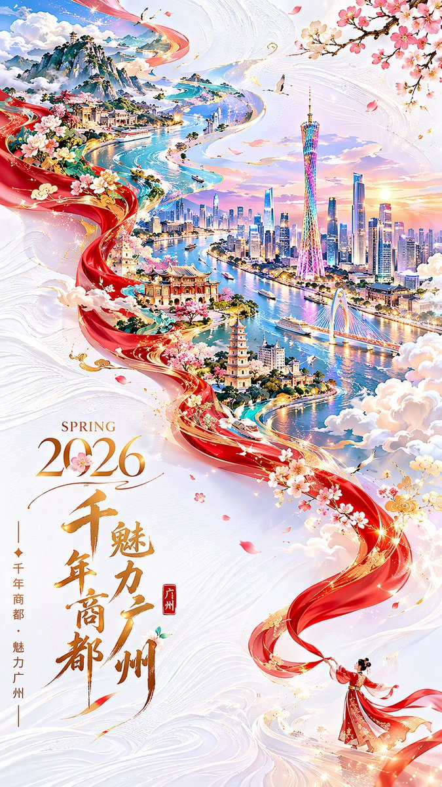 |

Source: [Tweet](https://twitter.com/alanlovelq/status/2045484598487060917)  
Title: **GPT image 2生成城市宣传海报。效果也太惊艳了吧！**  
**Prompt**
```text
一张充满新春喜庆氛围但不失高雅格调的 2026 城市宣传海报。
双重曝光，构图延续了S型的流动感；
在纯白的纹理背景右下角，一个身穿中国传统服饰的微缩人物正在挥舞着一条长长的红色丝绸舞带，这条红绸在空中舞动，不仅展现出丝绸的柔顺质感，更在向左上方飘动的过程中，奇幻地变形成了一条壮丽的山脉河流。
在这条“河流”中，叠加了一个有山有海河的广州城市手绘图，国潮，景色尽在眼底，壮阔雄伟，令人震撼。
广州的地标建筑(广州塔，珠江新城建筑群，珠江, 广州城里古建筑，游轮，白云山）。
云雾环绕，仙气缥缈，色彩丰富，结构复杂，细节丰富，但因为大面积的留白，画面依然显得清新脱俗，左下角排版着“SPRING 2026”和竖排的宣传语，整体寓意“千年商都，魅力广州”。
文字排版优美，大方，字迹清晰完整，尺寸9:16。
```


| Preview |
|---|
| 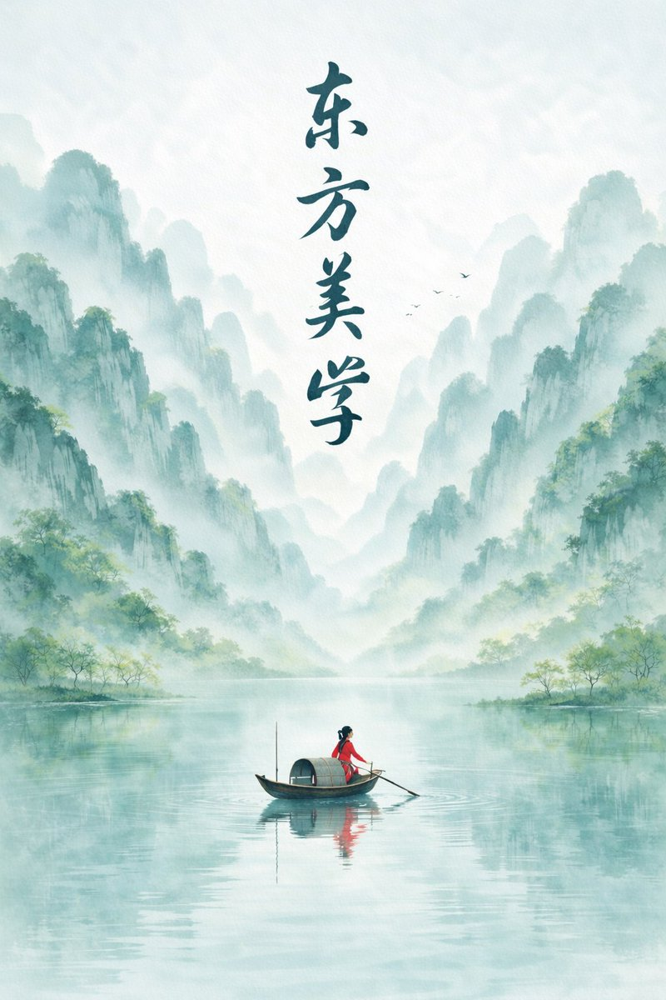 |

Source: [Tweet](https://x.com/liyue_ai/status/2046215276249993720)  
Title: **新中式水墨山水海报，竖版9:16构图，东方极简美学风格，大面积留白，主题是春岚一叶红。**  
**Prompt**
```text
新中式水墨山水海报，竖版9:16构图，东方极简美学风格，大面积留白，主题是春岚一叶红。
```


| Preview |
|---|
|  |

Source: [Tweet](https://x.com/A9Quant/status/2046228485841334559)  
Title: **请围绕【主题】自动生成一张顶级概念海报 / 信息图式电影海报。**  
**Prompt**
```text
要求 AI 根据这个主题,自动推导并统一设计以下全部视觉系统,不需要我额外指定:
- 如果主题偏权力、秩序、资本、统治,则自动偏向王座、冠冕、机械、神殿、红幕、金属、权力结构
- 如果主题偏科技、AI、芯片、未来,则自动偏向机械结构、能量核心、光束、深色金属、全息感
- 如果主题偏奢侈品、高定、稀缺、收藏,则自动偏向珠宝、镜面材质、黑金体系、展台、博物馆式布光
- 如果主题偏人物、IP、角色,则自动以人物为主视觉核心,并自动匹配对应世界观与象征系统
- 如果主题偏城市、文明、史诗、命运,则自动转化为宏大叙事型空间结构与仪式感场景
- 若主题适合中文,则优先生成中文标题;若主题更适合英文,则自动生成英文标题;也可中英结合,但必须统一高级
```


| Preview |
|---|
| 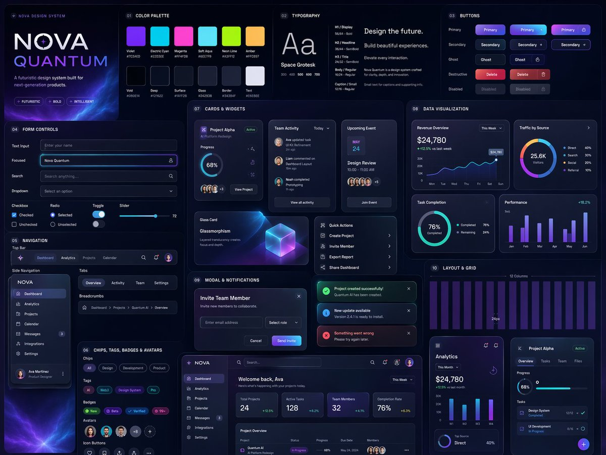 |

Source: [Tweet](https://x.com/MrLarus/status/2045504669401653414)  
Title: **请根据【主题】自动生成一张“博物馆图鉴式中文拆解信息图”。**  
**Prompt**
```text
要求整张图兼具真实写实主视觉、结构拆解、中文标注、材质说明、纹样寓意、色彩含义和核心特征总结。你需要根据【主题】自动判断最合适的主体对象、服饰体系、器物结构、时代风格、关键部件、材质工艺、颜色方案与版式结构，用户无需再提供其他信息。
若主题适合人物展示，则以真实人物全身站姿为中央主体；若更适合器物或单体结构，则改为中心主体拆解图，但整体仍保持完整中文信息图形式。所有文字必须为简体中文，清晰、规整、可读，不要乱码、错字、英文或拼音。重点突出真实结构、材质差异、文化说明与图鉴气质。
```

 
| Preview |
|---|
| 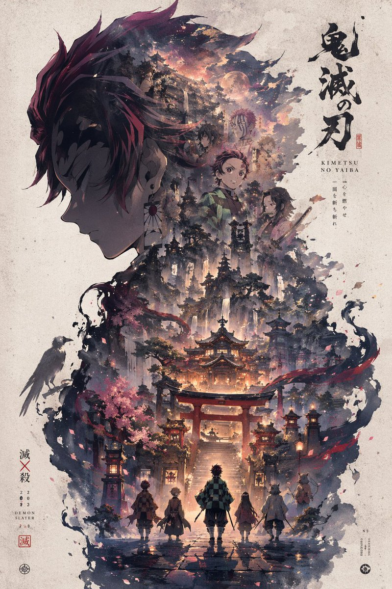 |

Source: [Tweet](https://x.com/MrLarus/status/2045418028733538620)  
Title: **请根据【主题：xxx】自动生成一张高审美的“轮廓宇宙 / 收藏版叙事海报”风格作品。不要将画面局限于固定器物或常见容器，不要优先默认瓶子、沙漏、玻璃罩、怀表之类...**  
**Prompt**
```text
请根据【主题：xxx】自动生成一张高审美的“轮廓宇宙 / 收藏版叙事海报”风格作品。不要将画面局限于固定器物或常见容器，不要优先默认瓶子、沙漏、玻璃罩、怀表之类的常规载体，而是由 AI 根据主题自行判断并选择一个最契合、最有象征意义、轮廓最强、最适合承载完整叙事世界的主轮廓载体。这个主轮廓可以是器物、建筑、门、塔、拱门、穹顶、楼梯井、长廊、雕像、侧脸、眼睛、手掌、头骨、羽翼、面具、镜面、王座、圆环、裂缝、光幕、阴影、几何结构、空间切面、舞台框景、抽象符号或其他更有创意与主题代表性的视觉轮廓，要求合理布局。优先选择最能放大主题气质、最能形成强烈视觉记忆点、最能体现史诗感、神秘感、诗意感或设计感的轮廓，而不是最安全、最普通、最常见的容器。
画面的核心不是简单把世界装进某个物体里，而是让完整的主题世界自然生长在这个主轮廓之中、之内、之上、之边界里或与其结构融为一体，形成一种“主题宇宙依附于一个象征性轮廓展开”的高级叙事效果。主轮廓必须清晰、优雅、有辨识度，并在整体构图中占据核心地位。轮廓内部或边界中需要自动生成与主题强绑定的完整叙事世界，内容应当丰富、饱满、层次清晰，包括最能代表主题的标志性场景、核心建筑或空间结构、象征符号与隐喻元素、角色关系或文明痕迹、远景中景近景的空间递进、具有命运感和情绪张力的氛围层次，以及门、台阶、桥梁、水面、烟雾、路径、光源、遗迹、机械结构、自然景观、抽象形态、生物或道具等叙事细节。所有元素必须统一、自然、有主次、有层级地融合，像一个完整世界真实孕育在这个轮廓结构之中，而不是简单拼贴、裁切填充、素材堆叠或模板化背景。
色彩由 AI 根据主题自动判断并匹配最合适的高级配色方案，但必须保持统一、克制、耐看、低饱和、高级，不要杂乱高饱和，不要廉价霓虹感，不要塑料数码感。配色可以围绕黑金灰、冷蓝灰、雾白灰、褐红米白、暗铜、旧纸色、深海蓝、暮色紫、银灰等体系自由变化，但必须始终服务主题，并保持海报级审美与整体和谐。
最终要求：第一眼有强烈的主题识别度和轮廓记忆点，第二眼有完整丰富的叙事世界，第三眼仍有细节和余味。轮廓选择必须具有创意和主题匹配度，尽量避免重复、保守、常见的容器套路，优先选择更有象征性、更有空间感、更有设计潜力的轮廓形式。不要普通背景拼接，不要生硬裁切，不要模板化奇幻素材，不要游戏宣传图感，不要过度卡通化，不要过度写实导致失去艺术感，不要形式大于内容。如果合适，可以自然加入低调克制的标题、编号、签名或落款，让它更像收藏版海报设计的一部分，但不要喧宾夺主。
```


| Preview |
|---|
| 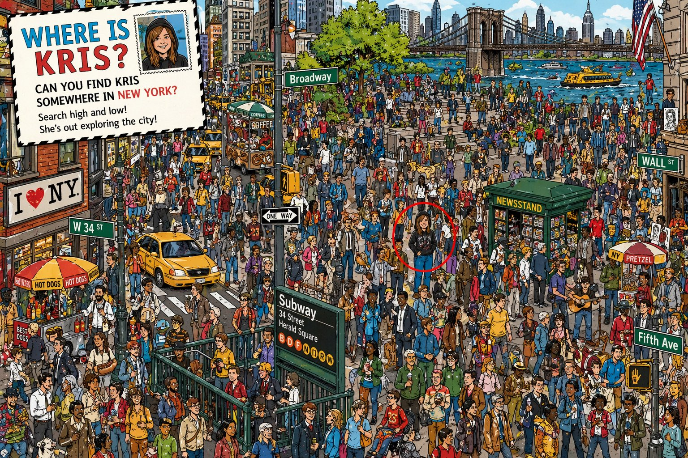 |

Source: [Tweet](https://x.com/icreatelife/status/2046639884421550482)  
Title: **Create a "Where is [Your Name]" crowd search poster set in the city of your choo...**  
**Prompt**
```text
Create a "Where is [Your Name]" crowd search poster set in the city of your choosing
```


| Preview |
|---|
| 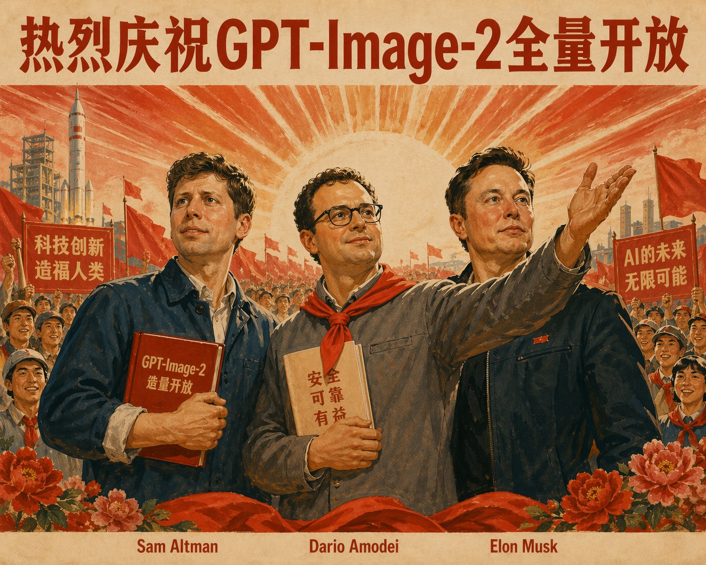 |

Source: [Tweet](https://x.com/akokoi1/status/2046558658096738672)  
Title: **Generate a 1980s propaganda poster. Use the exact slogan "热烈庆祝GPT-Image-2全量开放". ...**  
**Prompt**
```text
Generate a 1980s propaganda poster. Use the exact slogan "热烈庆祝GPT-Image-2全量开放". Include Sam Altman, Dario Amodei, and Elon Musk, and give Dario Amodei a red scarf.
```

  
| Preview 1 | Preview 2 |
|---|---|
|  |  |
|  |  |

Source: [Tweet](https://x.com/A9Quant/status/2046228485841334559)  
Title: **GPT-Image-2 prompt: please automatically generate a top-tier concept poster / in...**  
**Prompt**
```text
generate a top-tier concept poster / infographic-style movie poster centered around {argument name="theme" default="ranking of emperors in Chinese history"}.

Require the AI to automatically derive and uniformly design the entire following visual system based on this theme, without my extra specification:
- Core subject (automatically judge suitability for people, products, architecture, artifacts, symbols, scenes, or abstract imagery)
- Bottom supporting structure
- Hovering symbols or spiritual symbols above
- Scene wrapping elements
- Metaphor system
- Color hierarchy
- Material contrast
- Lighting logic
- Title, subtitle, and auxiliary copy
- Brand sense and high-end expression

The final frame must be: a shocking, precise, unified, cinematic, ultra-high detail conceptual key visual poster suitable for high-end printing.

[Overall Style]
Ultra-realistic 3D commercial CGI rendering, merging cinematic lighting, luxury visual language, futuristic concept design, and epic composition. The image must have a "single main visual core," not messy, not like a collage, and not like a regular e-commerce poster.

[Automatic Derivation Rules]
AI must automatically decide based on the [theme]:
1. Core visual metaphor
2. Subject type and posture
3. Form of supporting structure
4. Form of suspended elements
5. Scene shell and spatial atmosphere
6. Main, auxiliary, and emphasis colors
7. Material combinations
8. Text temperament and layout style

[Composition Rules]
- Absolute sense of premium quality
- Strong central order, overall unity
- Allows for axial symmetry or epic composition near the central axis
- Clear visual gravity, forming clear levels from top to bottom
- Edge negative space is clean, restrained, and has room to breathe

[Visual Quality]
- Ultra-high detail
- Clear volumetric light
- Authentic materials
- Natural reflection, refraction, shadows, fog, and depth of field
- Overall standard of high-end brand campaign key visual / luxury invitation poster / conceptual editorial poster

[Typography System]
- Overall 90% visual, 10% text
- AI automatically generates the most matching main title and subtitle based on the [theme]
- Title must be concise, sharp, and powerful
- Text should be as minimal and accurate as possible; do not stack words

[Signature Requirement]
Naturally add the author signature in the bottom corner: @a9quant
```

## Illustration & Artwork

7 prompt examples in this category.  
[Open doc](docs/illustration-artwork.md)


| Preview |
|---|
|  |

Source: [Tweet](https://twitter.com/liyue_ai/status/2045875219307655337)  
Title: **gpt image 2生成创意插画：锦鲤。**  
**Prompt**
```text
一幅超现实主义数字插画风格，采用低角度仰拍视角。画面描绘了一条巨型彩色锦鲤遨游在梦幻般的星云中，四周环绕着色彩鲜艳的星云与气泡。 
画面中央还站着一个小人，背对观众，神情平静地仰望空中这条巨大的锦鲤，锦鲤头向下看着小人。 
整体画面呈现出强烈的大小对比，氛围空灵又梦幻。比例9:16
```

 
| Preview |
|---|
|  |

Source: [Tweet](https://twitter.com/liyue_ai/status/2045744531686166878)  
Title: **gpt image 2生成城市宣传插画。**  
**Prompt**
```text
新中式极简风格高端城市海报，9:16竖版构图，以广州为核心主题，画面中心为抽象几何化的广州塔，造型简洁但具有辨识度，

整体采用S型流动构图，从下方向上延展，珠江水系被设计为流动的水波纹与传统祥云纹样融合，环绕整个画面形成视觉动线，

广州地标建筑以“留白+线描+局部色块”的方式点缀其中：珠江新城双塔、猎德大桥、白云山轮廓、岭南骑楼，
传统与现代建筑自然融合，层次递进，远近虚实分明，

风格控制：极简 + 高级 + 东方意境，不杂乱不过度写实，

色彩方案（重点）：
高饱和但克制 ，中国红、青蓝、鎏金为主色，
辅以少量暖金高光点缀，形成强烈视觉冲击但不俗艳，

背景：大面积纯净留白或淡宣纸肌理，增强呼吸感与高级感，

细节：祥云与水纹具有轻微浮雕/烫金质感，
局部加入微光粒子或流动光线，增强现代感，

光影：柔和渐变光+局部高光，突出恢弘大气氛围，

整体风格：国潮高级插画 / 品牌海报级质感 / 8K / 超清细节

---
注：提示词经ChatGPT优化
```


| Preview |
|---|
| 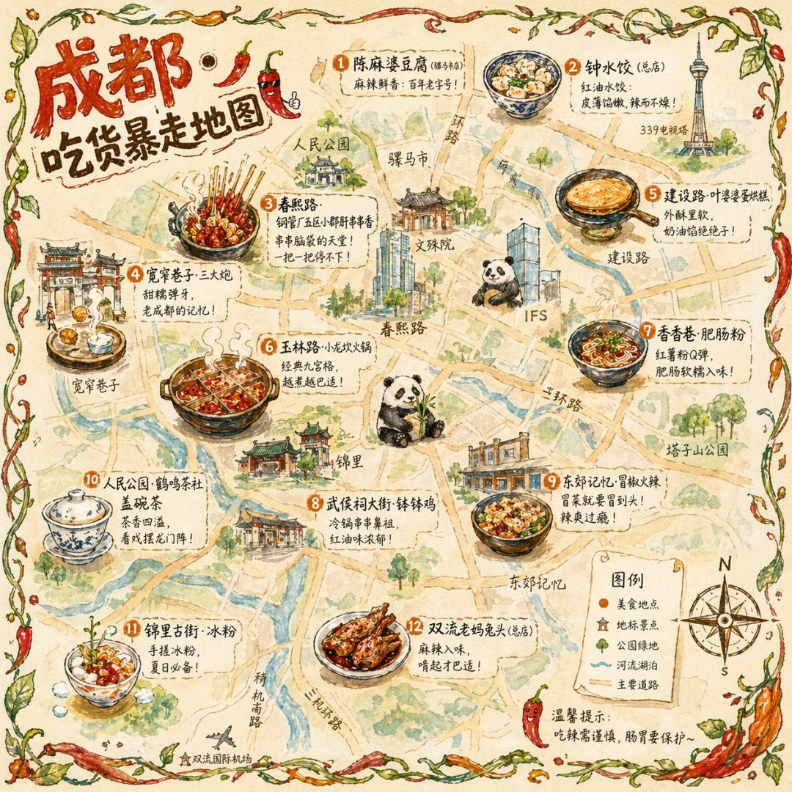 |

Source: [Tweet](https://x.com/Panda20230902/status/2045396918965285111)  
Title: **一张手绘风格的城市美食地图，以成都为主题。画面以鸟瞰视角的手绘简化城市地图为底，标注主要道路和地标但不追求精确比例而是追求可爱的手绘感。地图上分布着 12 个美...**  
**Prompt**
```text
一张手绘风格的城市美食地图，以成都为主题。画面以鸟瞰视角的手绘简化城市地图为底，标注主要道路和地标但不追求精确比例而是追求可爱的手绘感。地图上分布着 12 个美食地点的精致手绘小插画：春熙路的串串香（一把竹签插着各种食材冒着热气）、宽窄巷子的三大炮（三个糯米团子飞向铜盘）、建设路的蛋烘糕（金黄酥脆正在翻面）、玉林路的火锅（九宫格锅翻滚冒泡）等，每个插画约占地图的 5% 面积，旁边用手写体标注店名和一句推荐语"凌晨两点还在排队的那家"。地图边缘用手绘藤蔓和辣椒装饰形成边框。右下角有一个手绘指南针和图例说明。左上角标题"成都·吃货暴走地图"使用胖圆的手绘美术字配辣椒装饰。整体画风为水彩+彩铅混合的手绘质感，颜色以暖色系（辣椒红、姜黄、翠绿）为主，图片比例 1:1。
```

 
| Preview |
|---|
|  |

Source: [Tweet](https://x.com/blanplan/status/2045190582453350748)  
Title: **以涂鸦速写风表现【一个厉害的AI builder】，整体呈现快速勾勒、自由变形、即兴手绘与草稿式的视觉效果。线条随手、夸张、可粗细不一，略显凌乱但具有节奏和表现...**  
**Prompt**
```text
以涂鸦速写风表现【一个厉害的AI builder】，整体呈现快速勾勒、自由变形、即兴手绘与草稿式的视觉效果。线条随手、夸张、可粗细不一，略显凌乱但具有节奏和表现力，强调概括、夸张、趣味和随性，而不是严谨写实或精细刻画。  颜色采用粗糙、干刷感明显的块面表现，可保留不均匀的涂抹痕迹、刷痕、飞白与覆盖感，色彩根据【主题/主体】自动适配，但整体保持涂鸦式、速写式、概括式的表达。不要透明水彩晕染效果，不要细腻水彩过渡，不要纸纹理，不要柔和雾化，不要梦幻质感。  背景以留白为主，保持简洁、轻松、未完成感和设计感，可加入少量辅助性符号、箭头、记号、圈画、重复线、随手写的文字或其他涂鸦元素，以增强速写本或随笔式视觉语言，但不可过于拥挤，不可破坏主体和留白气质。  画面内容不需要预先写清楚，由【一个厉害的AI builder】自动推演并生成最适合的主体形象、动作、相关元素、符号或简化场景，整体保持统一的涂鸦速写风和夸张概括的表现方式，避免复杂写实背景和过度铺陈。 画面中需自然加入专属签名“BlanPlan”，作为画面的一部分，位置低调但清晰，可放在左下角、右下角或标题附近，风格需与整体版式统一，像作品署名或设计落款；签名字体精致、克制、高级，不可过大，不可破坏主体构图，不可显得突兀或廉价。
```


| Preview |
|---|
| 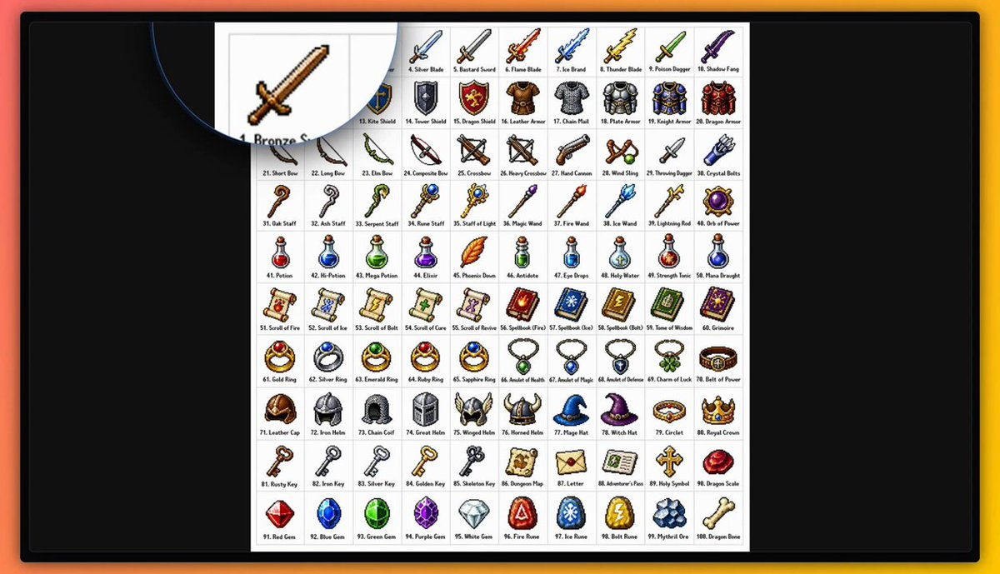 |

Source: [Tweet](https://x.com/ProperPrompter/status/2046534215311970694)  
Title: **Create a single image containing a grid of 100 completely unique pixel art items...**  
**Prompt**
```text
Create a single image containing a grid of 100 completely unique pixel art items, each with a meaningful label
```

 
| Preview 1 | Preview 2 |
|---|---|
|  |  |
|  |  |

Source: [Tweet](https://x.com/hx831126/status/2046454226080219281#reversed-3)  
Title: **{**  
**Prompt**
```text
"items": ["Designer", "Patternmaker", "Fabric Buyer", "Sample Maker", "Merchandiser", "QC", "Feedback Loop", "Model"]
```

 
| Preview 1 | Preview 2 |
|---|---|
| 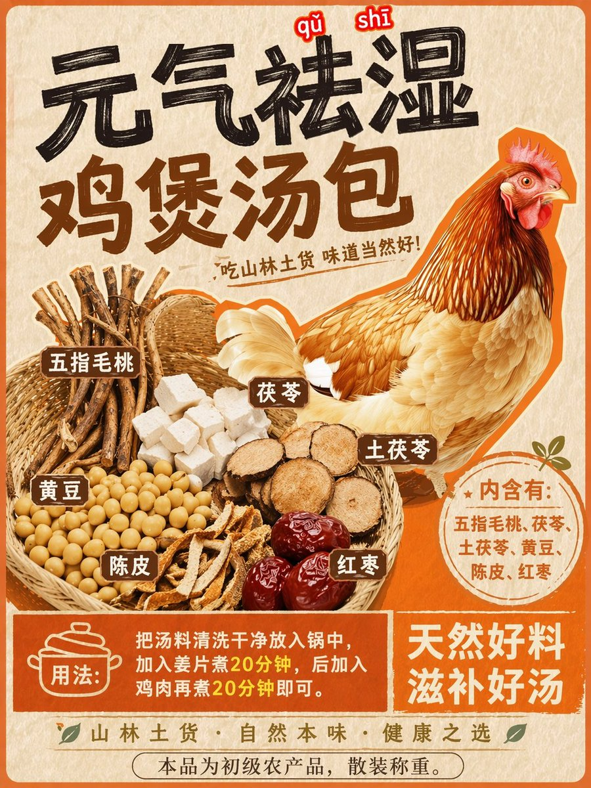 |  |
|  |  |

Source: [Tweet](https://x.com/xzjken/status/2045414765640786184#reversed-1)  
Title: **Using REFERENCE_0 as the base style and preserving the central chicken illustrat...**  
**Prompt**
```text
create a solid orange rectangular banner featuring a cooking pot icon, the text {argument name="usage instructions" default="用法:把汤料清洗干净放入锅中，加入姜片煮20分钟，后加入鸡肉再煮20分钟即可。"}, and a secondary slogan {argument name="bottom slogan" default="天然好料 滋补好汤"}.
```

## Typography & Text Layout

2 prompt examples in this category.  
[Open doc](docs/typography-text-layout.md)

 
| Preview |
|---|
|  |

Source: [Tweet](https://twitter.com/liyue_ai/status/2045772039521542202)  
Title: **gpt image 2生成城市足球超级联赛邀请函海报。**  
**Prompt**
```text
广东省城市足球超级联赛（粤超）邀请函海报设计，比例9:16； 

S型流动构图，画面从下方向上延展，一条由足球运动轨迹形成的动态能量流贯穿画面， 中心为一颗发光的足球，带有动感轨迹与能量光效；

沿S型动线融合广东城市地标与文化元素： 广州塔、深圳平安金融中心、珠海渔女雕像、岭南建筑与佛山武术剪影、中山孙中山文化象征、潮汕英歌舞动态人物轮廓、清远山水自然景观， 所有元素采用“线描 + 局部色块 + 留白”融合表现，层次递进、远近虚实结合；

加入抽象足球运动员剪影，弱化人物细节，强化动势与竞技氛围，视觉重点仍为足球；

风格：现代国潮高级海报，极简风格但富有设计感，高级、干净、统一， 融合东方美学与现代体育视觉；

色彩方案：高饱和但克制，中国红为主视觉，青蓝色辅助，金色点缀高光， 高对比但不杂乱，具有品牌级视觉冲击力； 

顶部中央横版视觉主标题 「广东省城市足球超级联赛」：中字，宋体， 中央竖排文字排版： 「粤超」，大字，手写书法艺术字体， 「邀请函」：中字，宋体，纵向排列，间距较大， 底部中央第一排横排： 「2026年4月25日」，小字，宋体，第二排：「广州越秀山体育场」，小字，宋体， 预留文字排版空间；

整体版式平衡、具有高级品牌海报质感，极致精细，构图简洁干净，无杂乱元素，电影级光影，8K 分辨率，高端设计感。融入源自中国传统祥云纹的雅致云纹与水波纹元素，浮动光效粒子，富有动感与生机。
```


| Preview |
|---|
| 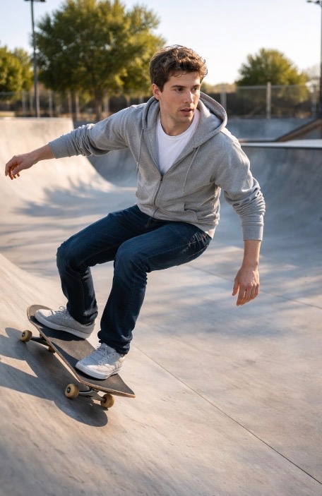 |

Source: [Tweet](https://x.com/liyue_ai/status/2045000106919997637)  
Title: **以眼部特写图片为基础，生成3:4的四屏构图超写实眼部特写，四屏按春夏秋冬上下排序。**  
**Prompt**
```text
以眼部特写图片为基础，生成3:4的四屏构图超写实眼部特写，四屏按春夏秋冬上下排序。
```

## Character & Avatar

7 prompt examples in this category.  
[Open doc](docs/character-avatar.md)


| Preview |
|---|
|  |

Source: [Tweet](https://x.com/Zoulinshen/status/2045082518089810073)  
Title: **生成一张竖版手机截图风格的图片，整体比例接近 9:16。画面中心偏上是一位真人 coser，扮演（角色名称）的二次元角色。人物为写实风格，但五官略带动漫感，皮肤...**  
**Prompt**
```text
生成一张竖版手机截图风格的图片，整体比例接近 9:16。画面中心偏上是一位真人 coser，扮演（角色名称）的二次元角色。人物为写实风格，但五官略带动漫感，皮肤细腻，眼睛稍大，表情温柔地看向镜头，坐在室内的休闲场景中，例如咖啡厅或酒吧吧台前，背景有符合场景的道具。画面最上方加入手机系统状态栏 UI，包括时间、电量、信号、网络等图标，让整张图看起来像手机截图。画面底部叠加一块宽大的半透明 galgame 风格对话框，对话框左侧放一个与画面人物对应的动漫或 Q 版头像；对话框右侧排版文字：第一行用较大字体显示与前面相同的角色名字，下面一到两行显示一段适合这个角色人设的、温柔治愈风格的简体中文台词，由你自动创作。再在对话框下方加一条操作栏，仿照 galgame UI。整体风格高清、细节丰富、光线柔和、二次元与真人写真自然融合。
```


| Preview |
|---|
| 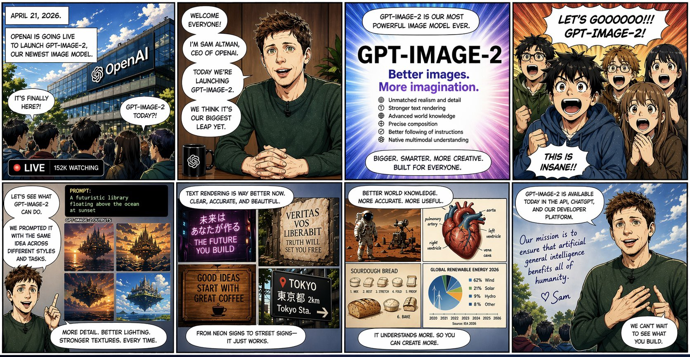 |

Source: [Tweet](https://x.com/venturetwins/status/2046620134933250409)  
Title: **Create an eight-panel manga about GPT-Image-2 launching today**  
**Prompt**
```text
Create an eight-panel manga about GPT-Image-2 launching today
```


Source: [Tweet](https://opennana.com/awesome-prompt-gallery/key-character-relationship-map)  
Title: **Please generate a key character relationship diagram for "XXX".**  
**Prompt**
```text
generate a key character relationship diagram for "XXX".
```


Source: [Tweet](https://raw.githubusercontent.com/ZeroLu/awesome-gpt-image/main/README.md)  
Title: **Create a 16-panel expression grid of a silver-haired, blue-eyed anime girl. Her ...**  
**Prompt**
```text
Create a 16-panel expression grid of a silver-haired, blue-eyed anime girl. Her face shape, hairstyle, and clothing must remain highly consistent across all panels. The 16 expressions should include: happy, sad, angry, surprised, shy, speechless, evil grin, contemplative, curious, proud, wronged, disdainful, confused, scared, crying, and a heart expression.
```

 

Source: [Tweet](https://opennana.com/awesome-prompt-gallery/official-character-reference-sheet)  
Title: **Based on this character and background, please create a character reference shee...**  
**Prompt**
```text
create a character reference sheet similar to official setting materials.
- Includes three-view drawings: front view, side view, and back view
- Add variations of the character's facial expressions
- Break down and display detailed parts of the clothing and equipment
- Add a color palette
- Include a brief explanation of the worldview setting
- Overall, use an organized layout (white background, illustration style)
```

 
| Preview 1 | Preview 2 |
|---|---|
| 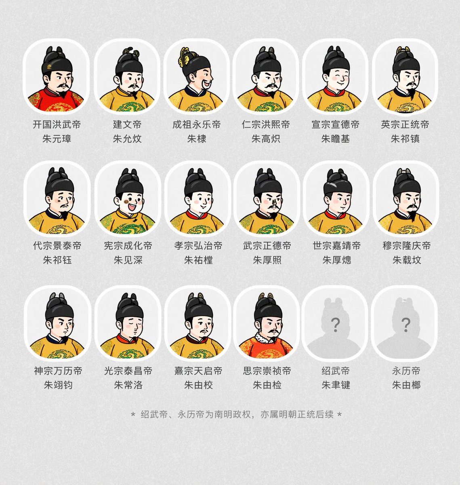 |  |
|  |  |

Source: [Tweet](https://x.com/liyue_ai/status/2045071977279635962)  
Title: **Generate avatars of various emperors from the {argument name="dynasty" default="...**  
**Prompt**
```text
Generate avatars of various emperors from the {argument name="dynasty" default="Ming Dynasty"} based on the style of the uploaded image, with their posthumous names and personal names listed below the avatars.
```

 
| Preview 1 | Preview 2 |
|---|---|
|  |  |
|  |  |

Source: [Tweet](https://x.com/wtry1102/status/2045281877452575125)  
Title: **Create {argument name="items" default="fan goods"} for a standard {argument name...**  
**Prompt**
```text
Create {argument name="items" default="fan goods"} for a standard {argument name="character type" default="Vtuber"} in {argument name="style" default="live-action"}
```

## UI, App & Dashboard

17 prompt examples in this category.  
[Open doc](docs/ui-app-dashboard.md)

 
| Preview 1 | Preview 2 |
|---|---|
| 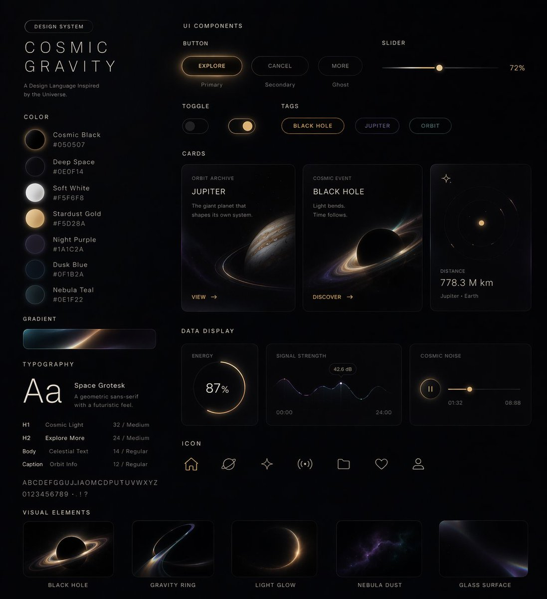 | 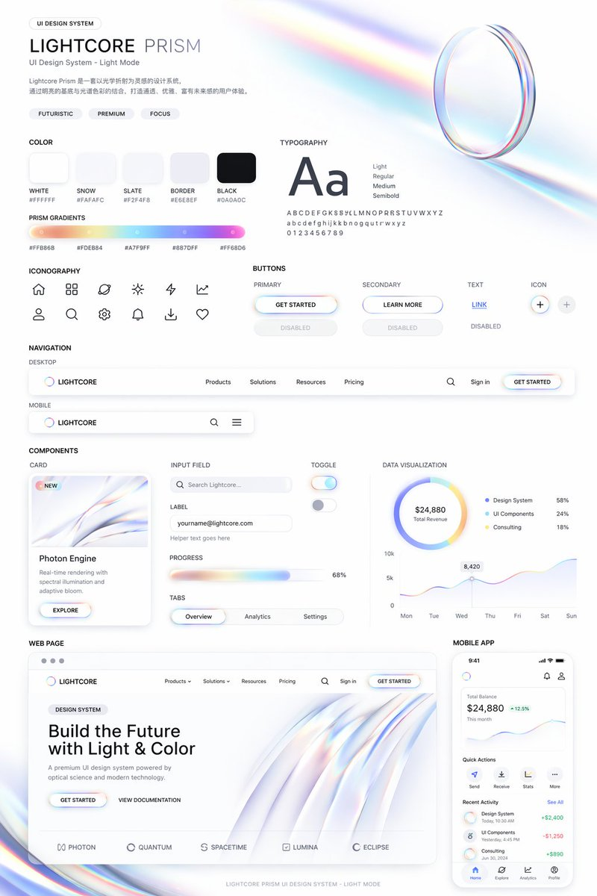 |
| 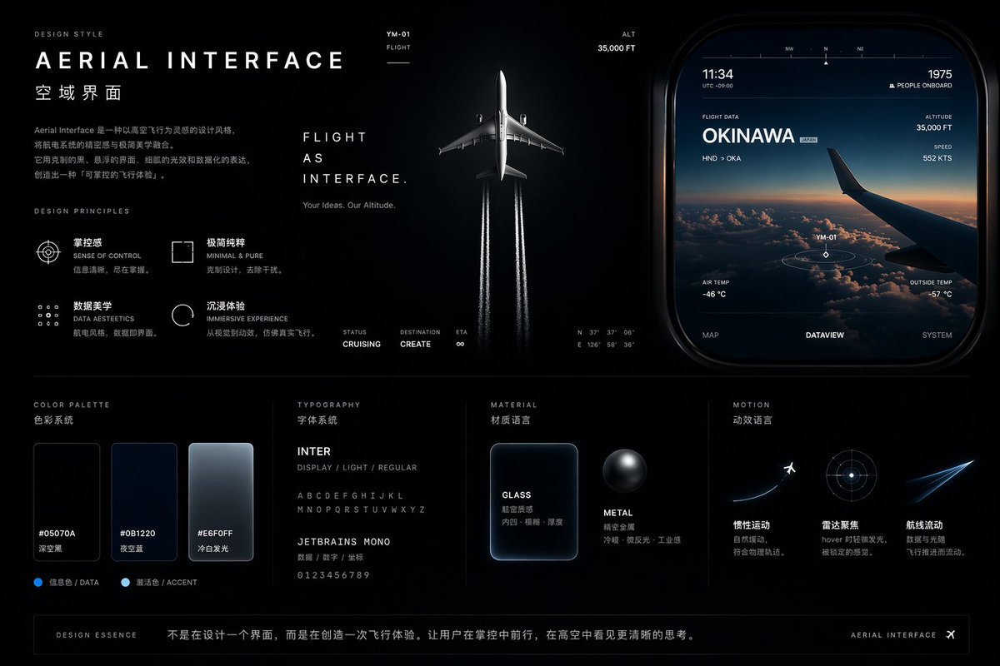 | 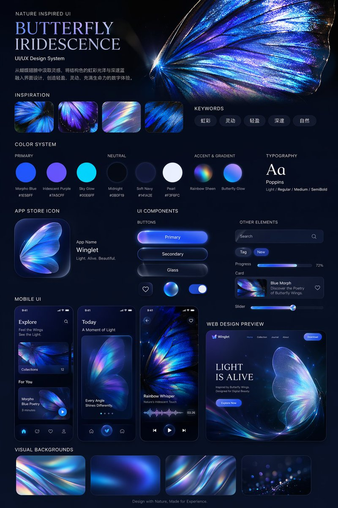 |

Source: [Tweet](https://twitter.com/stark_nico99/status/2045836554451706125)  
Title: **GPT image 2简直是绝佳的设计搭子**  
**Prompt**
```text
用这种风格帮我生成一套UI设计系统，包含网页、移动端、卡片、控件、按钮 以及其它 

把这套视觉风格作为参考生成网页
那视觉品质直接提升好几个level

我尝试了宇宙、飞行、蝴蝶主题，期待你的脑洞，可以丢在评论区
```

 
| Preview 1 | Preview 2 |
|---|---|
| 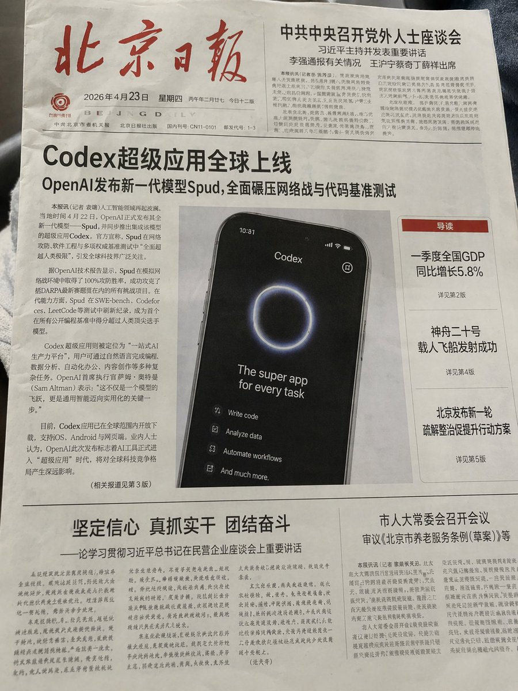 |  |
| 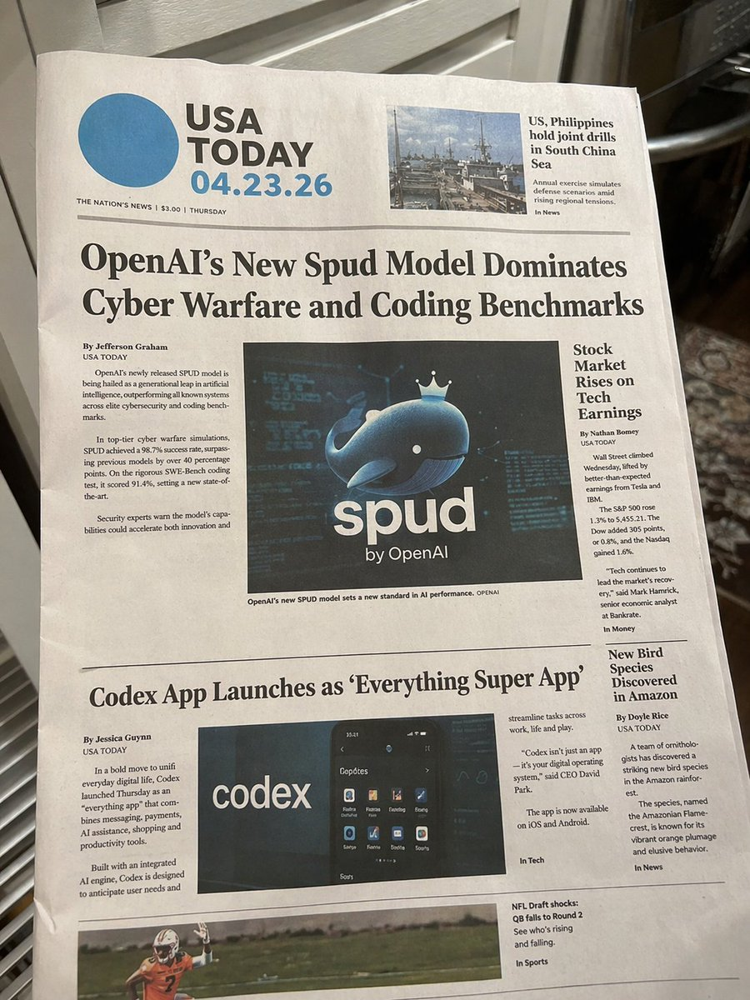 | 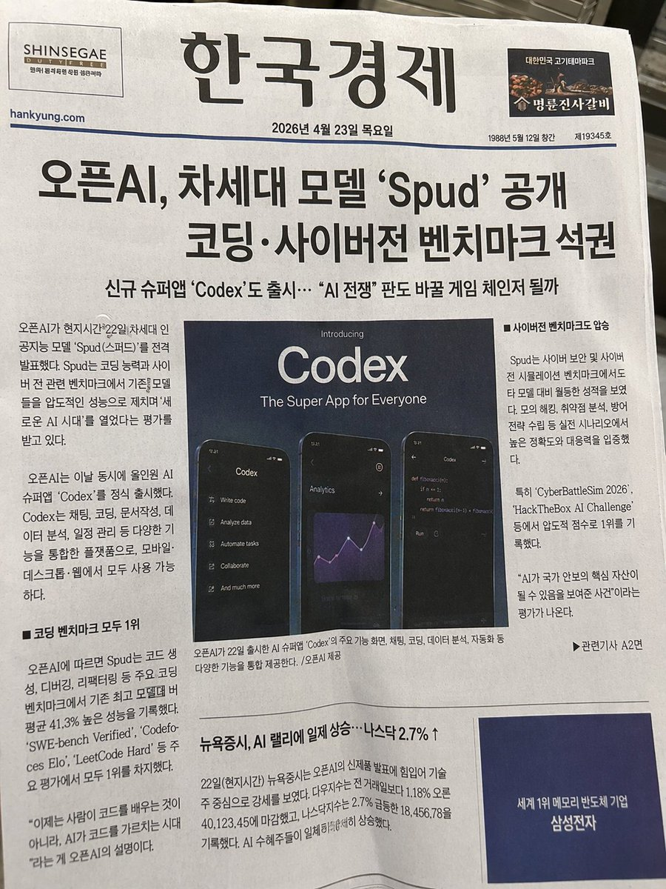 |

Source: [Tweet](https://twitter.com/ai_hakase_/status/2045700163277107473)  
Title: **【画像生成の常識が崩壊】GPT Image 2でUIデザインからコード実装まで完結！**  
**Prompt**
```text
【画像生成の常識が崩壊】GPT Image 2でUIデザインからコード実装まで完結！
UIデザインからデプロイ可能なコード生成までを一気通貫で実行。開発の常識を覆す革命的な進化です！✨
```


| Preview |
|---|
|  |

Source: [Tweet](https://x.com/austinit/status/2044968740782272596)  
Title: **用这种风格帮我生成一套UI设计系统，包含网页、移动端、卡片、控件、按钮 以及其它**  
**Prompt**
```text
用这种风格帮我生成一套UI设计系统，包含网页、移动端、卡片、控件、按钮 以及其它
```


| Preview |
|---|
|  |

Source: [Tweet](https://x.com/stark_nico99/status/2045836554451706125)  
Title: **用这种风格帮我生成一套UI设计系统，包含网页、移动端、卡片、控件、按钮以及其它。把这套视觉风格作为参考生成网页。我尝试了宇宙、飞行、蝴蝶主题。**  
**Prompt**
```text
用这种风格帮我生成一套UI设计系统，包含网页、移动端、卡片、控件、按钮以及其它。把这套视觉风格作为参考生成网页。我尝试了宇宙、飞行、蝴蝶主题。
```


Source: [Tweet](https://x.com/pfanis/status/2046414546378584558)  
Title: **Generate for me a UI design system with a very cutting-edge, bold, and unique th...**  
**Prompt**
```text
Generate for me a UI design system with a very cutting-edge, bold, and unique theme that includes glassy visuals and transparencies
```


| Preview |
|---|
|  |

Source: [Tweet](https://x.com/AZLnfvp/status/2046468976092533180)  
Title: **用未来都市风格生成UI设计系统,灵感来自赛博朋克城市夜景,包含霓虹灯、玻璃建筑反射、高对比光影,配色以紫色、蓝色、粉色霓虹为主,设计网页Dashboard、移动...**  
**Prompt**
```text
用未来都市风格生成UI设计系统,灵感来自赛博朋克城市夜景,包含霓虹灯、玻璃建筑反射、高对比光影,配色以紫色、蓝色、粉色霓虹为主,设计网页Dashboard、移动端界面、卡片、按钮、控件等,视觉炫酷、层次丰富、科技感极强
```

 

Source: [Tweet](https://raw.githubusercontent.com/ZeroLu/awesome-gpt-image/main/README.md)  
Title: **Create a high-fidelity Chinese music app player interface screenshot in mobile p...**  
**Prompt**
```text
Create a high-fidelity Chinese music app player interface screenshot in mobile portrait orientation, with refined visuals similar to a modern streaming player. Use dark mode, with the background derived from a blurred and diffused version of the album cover colors. Place a large square album cover in the center with subtle shadow and rounded corners.

Interface requirements:
- top status bar with time 18:26
- navigation bar with a back arrow on the left, a centered title, and a more-options icon on the right
- playback progress bar showing current time 01:42 and total duration 04:18
- playback controls for shuffle, previous, play/pause, next, and repeat
- lyrics section showing 5 to 7 scrolling lines, with the current line highlighted
- action row with like, comment, download, add to playlist, and share
- bottom area with device casting and playback queue entry

Use these exact Chinese labels and names:
- title: "正在播放"
- song name: "海边的晚风"
- artist: "林秋"
- album: "夏夜实验室"

The lyrics layout, button icons, reflections, shadows, and dark-mode layering should feel like a real production interface rather than a Dribbble concept.
```

 

Source: [Tweet](https://raw.githubusercontent.com/ZeroLu/awesome-gpt-image/main/README.md)  
Title: **Create a high-end skincare e-commerce hero poster for "澄光维稳精华" ("Clarifying Stab...**  
**Prompt**
```text
Create a high-end skincare e-commerce hero poster for "澄光维稳精华" ("Clarifying Stabilizing Essence"). The style should be clean, light-luxury, and strongly science-skincare oriented. In the center, place a semi-transparent frosted-glass essence bottle filled with golden liquid and subtle water-droplet reflections. Use an off-white to warm gray gradient background with liquid-flow elements and microscopic molecular-structure decoration.

The poster must include the following exact Chinese copy:
"澄光"
"维稳精华"
"修护屏障"
"舒缓泛红"
"细腻透亮"
"第 2 代升级配方"
"核心成分"
"神经酰胺"
"泛醇 B5"
"积雪草提取物"
"微囊脂质体"
"适合人群"
"敏感肌"
"熬夜肌"
"换季不稳定肌"
"限时到手价 229 元"
"买 1 送 3"
"赠洁面 15ml"
"赠精华 5ml"
"赠面霜 10g"

Fine print:
"实际效果因人而异，请坚持使用"

Focus on product selling points, pricing hierarchy, gift-list modules, product naming, and short functional phrases. The result should feel premium and not tacky or overly live-commerce styled.
```

  
| Preview 1 | Preview 2 |
|---|---|
|  |  |
|  |  |

Source: [Tweet](https://x.com/MrLarus/status/2046627021674168640)  
Title: **Automatically generate a high-aesthetic "Silhouette Universe / Collector's Editi...**  
**Prompt**
```text
generate a high-aesthetic "Silhouette Universe / Collector's Edition Narrative Poster" based on [theme: xxx]. Do not default to common containers such as bottles, hourglasses, glass domes, or pocket watches. Instead, let the AI choose the most symbolic, visually strong, and narratively suitable outer silhouette for the theme. The silhouette can be an artifact, building, gate, tower, archway, dome, stairwell, corridor, statue, profile, eye, hand, skull, wing, mask, mirror, throne, ring, crack, light curtain, shadow, geometric form, spatial cross-section, stage frame, abstract symbol, or any more creative contour that best represents the theme.

The goal is not to simply place a world inside an object, but to make the entire themed universe grow naturally within, around, and through the silhouette itself. The silhouette should be elegant, recognizable, and compositionally dominant. Inside or along its boundary, generate a rich and layered narrative world strongly tied to the theme, including iconic scenes, key architecture or spaces, symbols and metaphors, traces of characters or civilizations, foreground-midground-background depth, and atmosphere with emotional tension. Elements such as doors, staircases, bridges, water, smoke, paths, light sources, ruins, mechanical structures, landscapes, abstract forms, creatures, or props should all feel unified and organically integrated rather than pasted together.

The final composition should feel like a premium collector's poster with strong design value. The large shapes should feel stable, the main silhouette should be unmistakable, and the inner world should have depth, structure, and breathing room. Details should be rich but not crowded. You may add small human silhouettes, distant buildings, beams of light, doorways, bridges, steps, corridors, reflections, skylight, or far-background structures to enhance scale, story, and epic atmosphere. The overall mood should be quiet, grand, refined, and lingering rather than noisy or overloaded.

Blend the feeling of a collector's edition film poster, high-end narrative visual design, dreamy watercolor texture, and fine printed paper. Emphasize paper grain, feathered edges, watercolor brush marks, gentle diffusion, atmospheric perspective, soft haze, selective volumetric light, light passing through mist, generous negative space, and restrained layout. The image should feel premium, poetic, majestic, sacred, nostalgic, quiet, and mythic.

Let the AI choose an elevated color palette based on the theme, but keep it unified, restrained, tasteful, low-saturation, and premium. Avoid chaotic high saturation, cheap neon effects, or plastic digital color. Suitable palette families may include black-gold-gray, cool blue-gray, mist white-gray, brown-red with off-white, dark copper, aged paper tones, deep sea blue, twilight purple, or silver-gray, as long as they serve the theme.

Final requirement: the first glance should give strong theme recognition and a memorable silhouette, the second glance should reveal a complete narrative world, and the third glance should still reward close inspection with depth and aftertaste. Avoid generic backgrounds, hard cut-and-paste compositions, templated fantasy assets, video-game promo art vibes, excessive cartooning, or realism that kills the artistic mood. If appropriate, subtle titles, numbering, signatures, or marks can be added as part of the poster design, but they must never overpower the image.
```

 
| Preview 1 | Preview 2 |
|---|---|
| 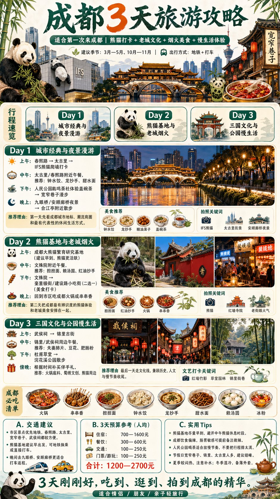 | 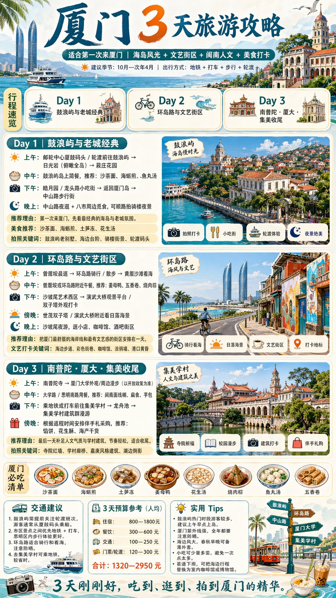 |
| 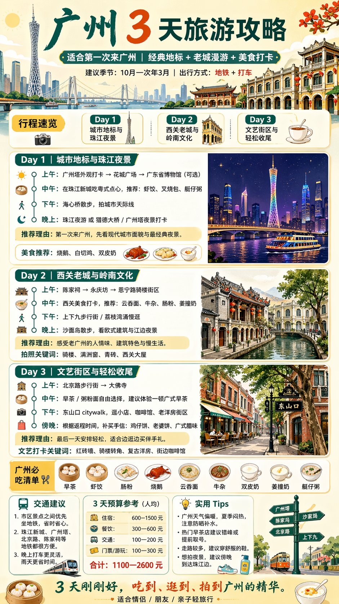 |  |

Source: [Tweet](https://x.com/MrLarus/status/2046627021674168640)  
Title: **Generate a three-day travel guide image for [city]**  
**Prompt**
```text
Generate a three-day travel guide image for [city]
```

 

Source: [Tweet](https://raw.githubusercontent.com/ZeroLu/awesome-gpt-image/main/README.md)  
Title: **Theme: \"77 (cat's name) X KFC\" collaboration poster. Generate a collaboration ...**  
**Prompt**
```text
Generate a collaboration poster featuring the same pet (absolutely consistent in appearance and coloring) with KFC brand identity (red-and-white color scheme, classic logo, restaurant scenes, etc.). Have the cat wear a KFC employee uniform, KFC employee hat, and name badge while standing at the counter, selling fried chicken, burgers, and combo meals, and interacting with chicken buckets, fries, soda, and other brand elements. The style should be lively and fun with a commercial co-branding feel, suitable for online promotion and event posters. Add appropriate Chinese copy freely for the poster.
```

 
| Preview 1 | Preview 2 |
|---|---|
|  |  |
|  |  |

Source: [Tweet](https://x.com/danieldmai/status/2046170898118435090#reversed-1)  
Title: **Using REFERENCE_0, transform the subject's appearance to a {argument name="style...**  
**Prompt**
```text
make her skin tone slightly paler. Add 2 facial piercings: a septum ring and a nostril stud. Finally, modify her layered necklaces to feature {argument name="necklace pendants" default="an inverted cross and a pentagram"}.
```

_More in [docs/ui-app-dashboard.md](docs/ui-app-dashboard.md)._

## Social Media Screenshot

8 prompt examples in this category.  
[Open doc](docs/social-screenshot.md)


| Preview |
|---|
|  |

Source: [Tweet](https://x.com/alanblogsooo/status/2044784762594918516)  
Title: **9:16 的图片比例，生成一张抖音直播的截图，里面是 刘亦菲 在直播，刘亦菲 手里拿着牌子，牌子里写着 今晚直播，欢迎来参亦菲畅聊！**  
**Prompt**
```text
9:16 的图片比例，生成一张抖音直播的截图，里面是 刘亦菲 在直播，刘亦菲 手里拿着牌子，牌子里写着 今晚直播，欢迎来参亦菲畅聊！
```

 
| Preview |
|---|
|  |

Source: [Tweet](https://x.com/Shinning1010/status/2046501587762188535)  
Title: **A 9:16 vertical version, high-detail realistic style Chinese TikTok live screens...**  
**Prompt**
```text
A 9:16 vertical version, high-detail realistic style Chinese TikTok live screenshot, Elon Musk is talking to the mobile phone camera in the live broadcast room, excited, smiling, and the live atmosphere is warm and real. He held a white handwritten sign in one hand, which clearly said: "Thank you Shinning". There are obvious Chinese TikTok interface elements in the live broadcast screen, including likes, comments and share icons arranged vertically on the right, scrolling Chinese bullet screens and interactive comments below, and the "live broadcast" logo at the top, which looks like a real mobile phone screenshot. There is an eye-catching gift prompt special effect in the screen: "Shinning sent TikTok No. 1", with gift animation light effect and platform-style prompt box. Musk is in a professional live broadcast environment, with a mobile phone holder, a ring fill light and a desktop microphone in front of him. The background is a modern technology live broadcast room with bright lights and a slight neon atmosphere. The composition is real and natural, like the ongoing live screenshot of the Chinese short video platform. The interface information is rich but not messy, the characters are clear, the expression is vivid, the details are rich, the sense of real photography, the depth of field, high definition, cinematic, photorealistic, realistic livestream screenshot, social media UI, Chinese Douyin live room, detailed lighting, natural skin texture.
Real mobile phone screen recording screenshot feeling, the live broadcast UI is complete, the gift prompt box conforms to the style of the Chinese short video platform, the Chinese comment area is active, the number of people online in the live broadcast room is clearly displayed, and the time, power and signal bar are visible.
```


| Preview |
|---|
| 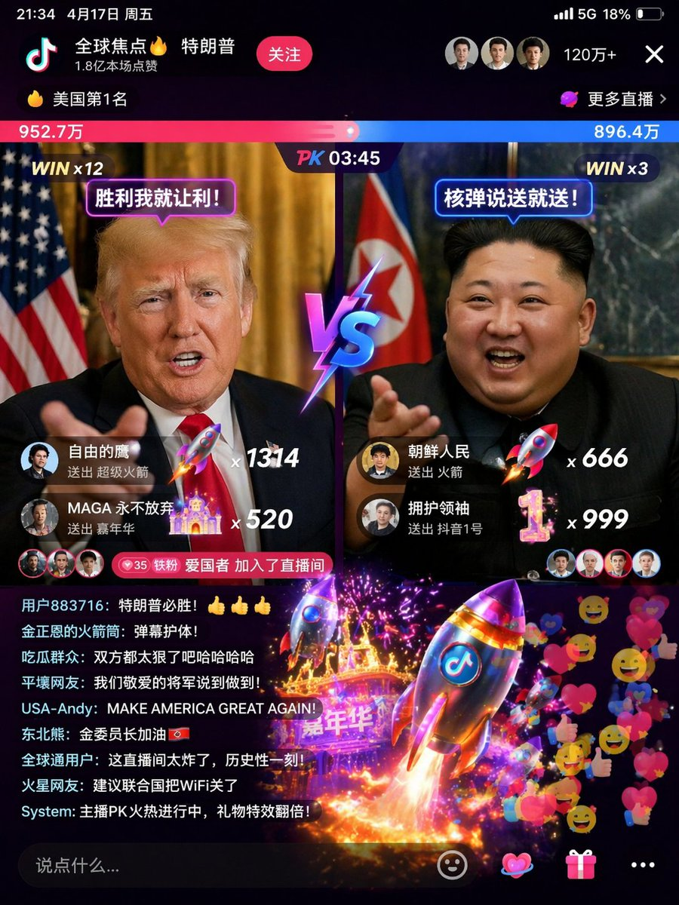 |

Source: [Tweet](https://x.com/alanlovelq/status/2046048929490612464)  
Title: **1、生成特朗普和金正恩在抖音直播间打PK的截图**  
**Prompt**
```text
3、生成图片: 手写在教室黑板上的出师表全文,真实感的粉笔字迹,晴朗白天用iPhone手机实拍
4、生成图片: T-800机器人的淘宝商品详情页,展示: 机器人的正面侧面背面三视图, 产品价格, 产品细节, 功能和使用场景等
```

 
| Preview 1 | Preview 2 |
|---|---|
| 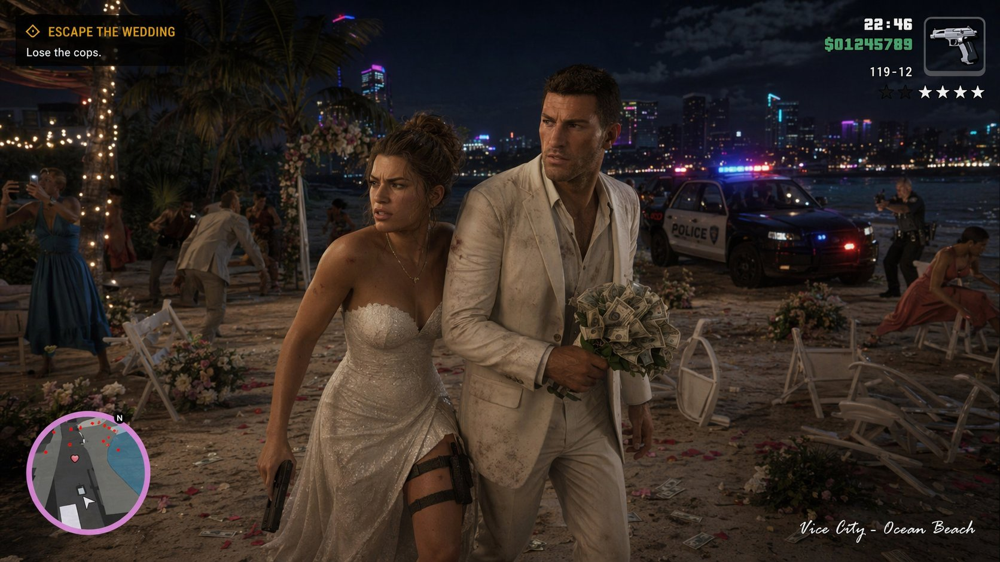 | 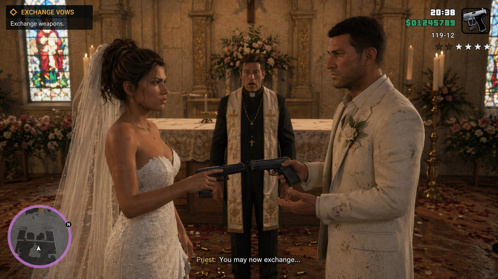 |
| 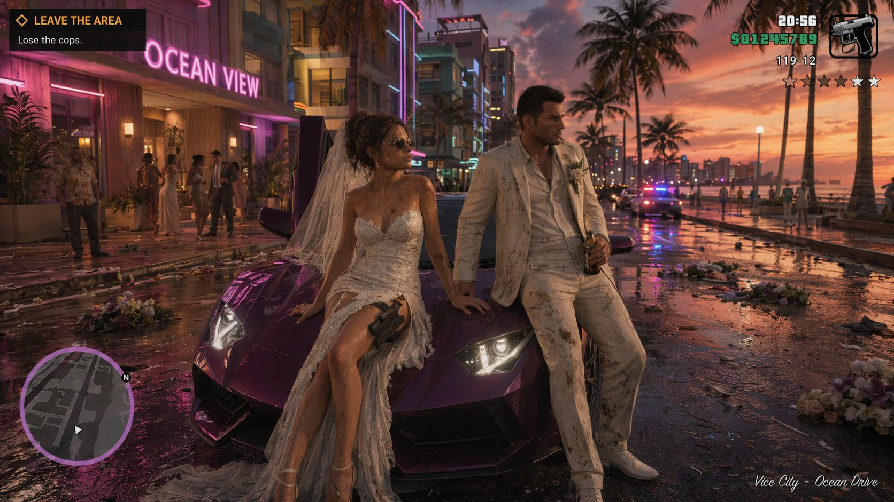 | 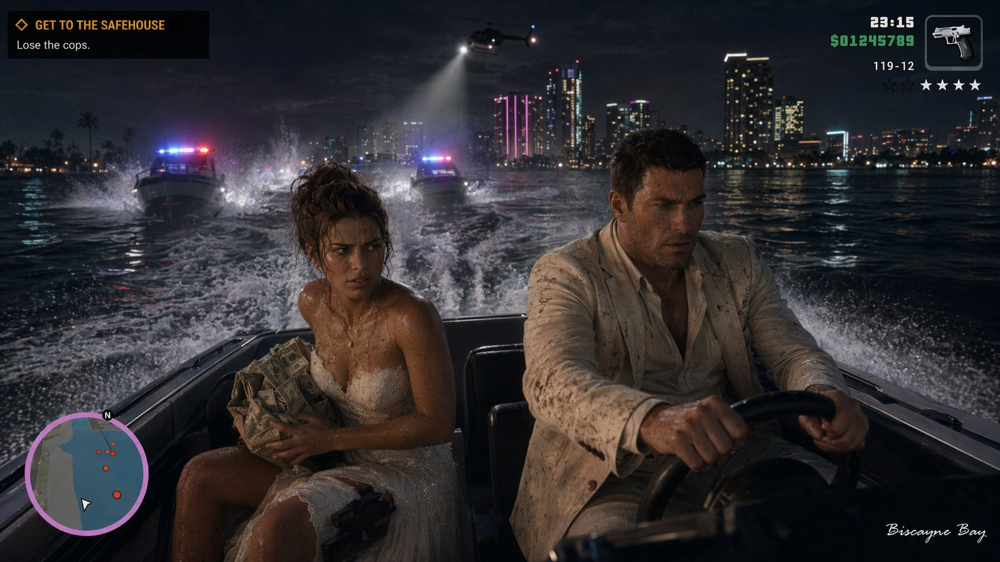 |

Source: [Tweet](https://x.com/MrLarus/status/2046627021674168640)  
Title: **Generate a GTA 6 gameplay screenshot of [scene description]**  
**Prompt**
```text
Generate a GTA 6 gameplay screenshot of [scene description]
```


| Preview |
|---|
| 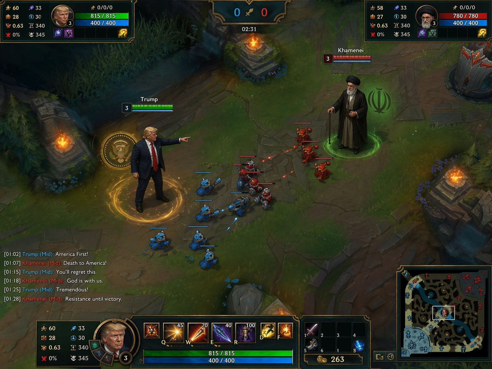 |

Source: [Tweet](https://x.com/underwoodxie96/status/2046529342415790275)  
Title: **Help me generate a screenshot of Trump versus Khamenei in the mid lane in League...**  
**Prompt**
```text
generate a screenshot of Trump versus Khamenei in the mid lane in League of Legends
```


Source: [Tweet](https://raw.githubusercontent.com/ZeroLu/awesome-gpt-image/main/README.md)  
Title: **Generate a screenshot of a TikTok live stream featuring a beautiful woman stream...**  
**Prompt**
```text
Generate a screenshot of a TikTok live stream featuring a beautiful woman streaming.
```


Source: [Tweet](https://opennana.com/awesome-prompt-gallery/liu-yifei-douyin-live-chat)  
Title: **9:16 aspect ratio, generate a screenshot of a Douyin live stream, inside is Liu ...**  
**Prompt**
```text
generate a screenshot of a Douyin live stream, inside is Liu Yifei live streaming, Liu Yifei is holding a sign in her hand, the sign says Tonight's live stream, welcome to join Yifei for a chat!
```

 
| Preview 1 | Preview 2 |
|---|---|
| 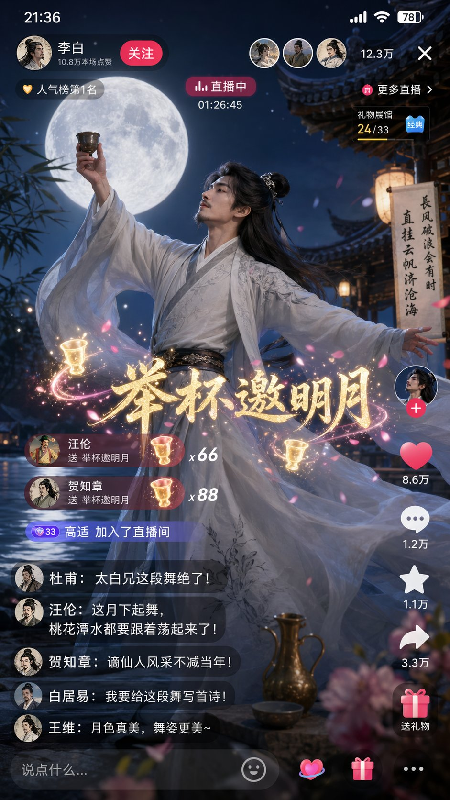 | 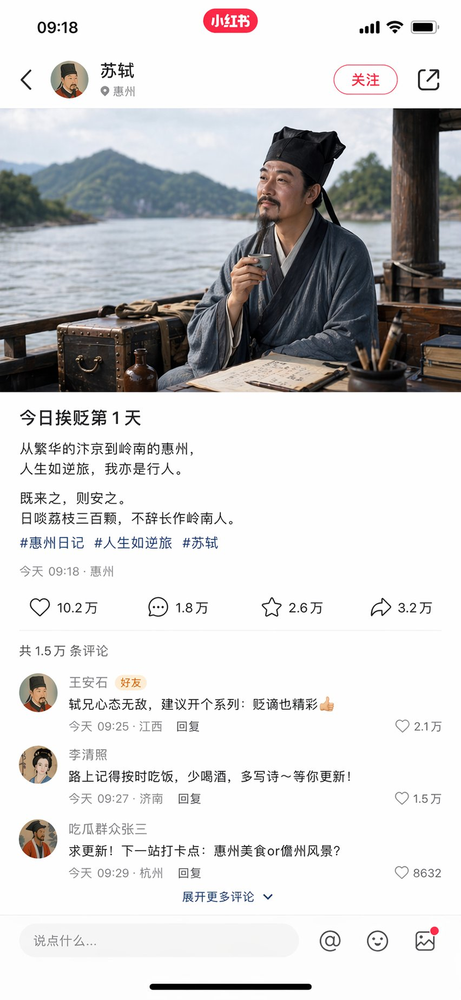 |
|  | 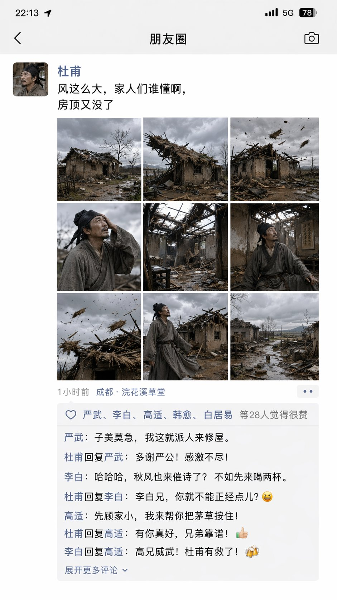 |

Source: [Tweet](https://x.com/MrLarus/status/2046627021674168640)  
Title: **Generate a screenshot of [historical figure name] on [platform name]**  
**Prompt**
```text
Generate a screenshot of [historical figure name] on [platform name]
```

## Infographic & Diagram

7 prompt examples in this category.  
[Open doc](docs/infographic-diagram.md)


Source: [Tweet](https://opennana.com/awesome-prompt-gallery/jingdezhen-blue-white-porcelain-diagram)  
Title: **Generate a detailed explanatory diagram of Jingdezhen blue and white porcelain, ...**  
**Prompt**
```text
Generate a detailed explanatory diagram of Jingdezhen blue and white porcelain, accompanied by detailed Chinese knowledge analysis.
```

 

Source: [Tweet](https://opennana.com/awesome-prompt-gallery/museum-level-chinese-disassembly-infographic)  
Title: **Please automatically generate a "museum catalog-style Chinese disassembly infogr...**  
**Prompt**
```text
generate a "museum catalog-style Chinese disassembly infographic" based on the [Subject].

The entire image is required to combine a realistic main visual, structural disassembly, Chinese annotations, material descriptions, pattern meanings, color meanings, and core feature summaries. You need to automatically determine the most appropriate main subject, clothing system, artifact structure, era style, key components, material craftsmanship, color scheme, and layout structure based on the [Subject], and the user does not need to provide any other information.

The overall style should be: national museum exhibition boards, historical clothing catalogs, and cultural/museum thematic infographics, rather than ordinary posters, ancient-style portraits, e-commerce detail pages, or anime illustrations. The background uses paper textures such as off-white, silk white, and light tea color, making the overall look premium, restrained, professional, and collectible.

The layout is fixed as:
- Top: Chinese main title + subtitle + introduction
- Left: Structural disassembly area, with Chinese lead lines annotating key components, accompanied by close-up details
- Upper right: Material / craftsmanship / texture area, displaying real texture samples with descriptions
- Middle right: Pattern / color / meaning area, displaying the main color palette, pattern samples, and cultural explanations
- Bottom: Dressing order / composition flowchart + core feature summary

If the subject is suitable for character display, use a full-body standing posture of a real person as the central subject; if it is more suitable for artifacts or single structures, change it to a central subject disassembly diagram, but the overall form remains a complete Chinese infographic. All text must be in Simplified Chinese, clear, neat, and readable, without garbled characters, typos, English, or pinyin. The focus is on highlighting real structures, material differences, cultural explanations, and a catalog atmosphere.

Avoid: poster feel, studio portrait feel, e-commerce feel, anime feel, cosplay feel, random annotations, incorrect structures, blurry text, fake materials, excessive decoration.
```

  
| Preview 1 | Preview 2 |
|---|---|
| 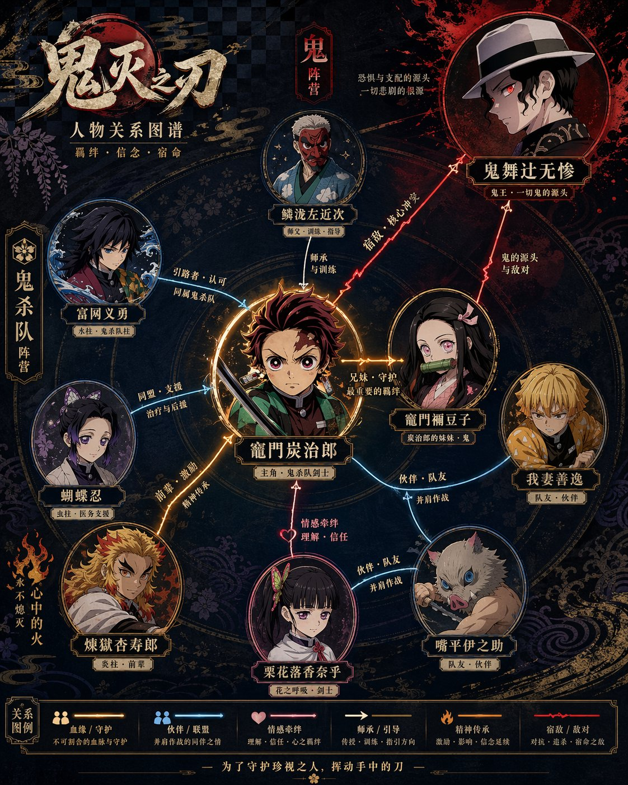 | 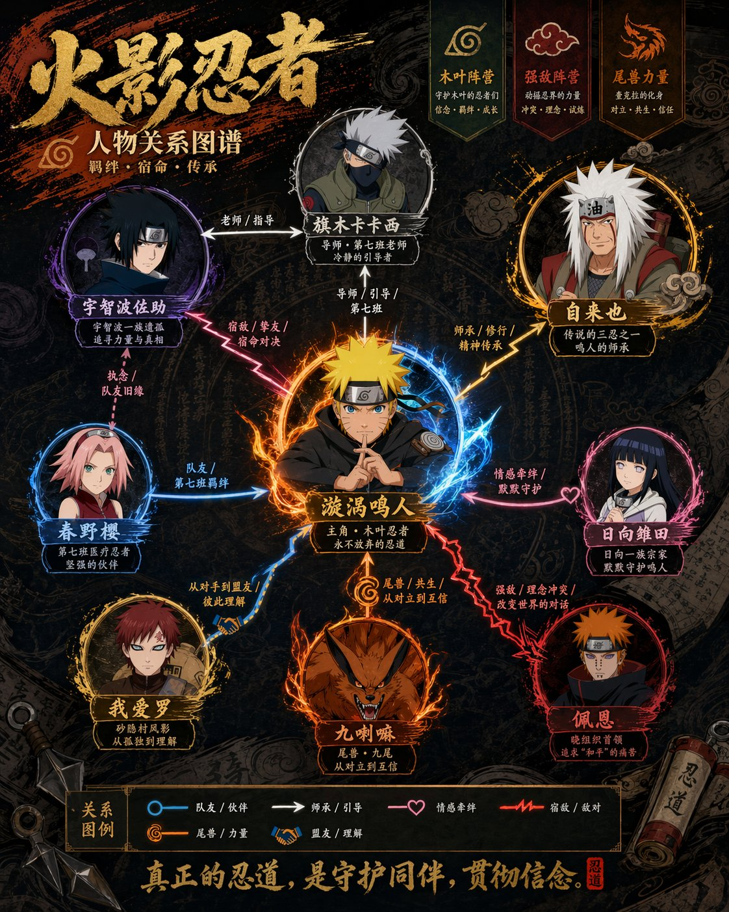 |
| 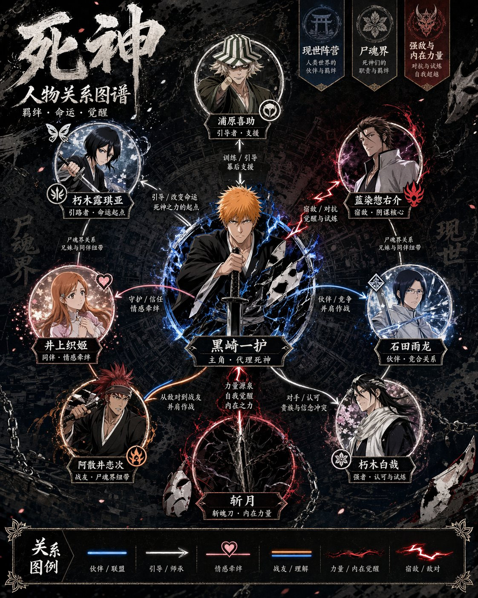 | 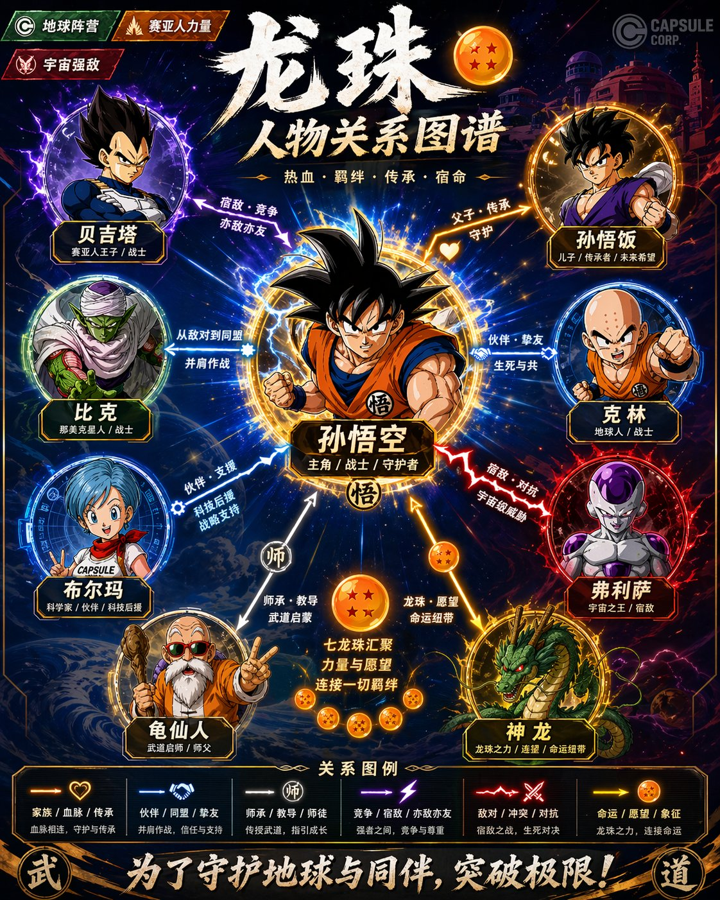 |

Source: [Tweet](https://x.com/MrLarus/status/2046627021674168640)  
Title: **Generate a high-design character relationship poster for [theme]. This should no...**  
**Prompt**
```text
Generate a high-design character relationship poster for [theme]. This should not be a normal illustration, but a relationship map that combines information visualization, narrative structure, poster-level design, and strong fidelity to the style of the original work.

Automatically do the following:
- identify the source work and its core setting
- select the 6 to 12 most representative key characters, with an upper limit of 15 if needed
- identify and show the most important relationships, such as family ties, romance, friendship, alliances, hostility, mentor-student links, master-servant links, manipulation, betrayal, and hidden relationships
- choose the most suitable composition automatically, such as protagonist-centered, dual-core confrontation, faction layout, family tree, or time-evolution structure
- extract the work's style DNA, including color palette, worldbuilding symbols, texture language, emotional tone, layout rhythm, and iconic motifs
- convert those style elements into the overall visual design of the relationship map rather than simply copying an official poster
- use different colors, line styles, and arrows to distinguish relationship types while keeping the layout clear and readable
- emphasize the core characters most strongly, secondary characters next, and minor characters less prominently to create a clear visual hierarchy
- keep every character name easy to read, optionally with role or faction tags if useful

The final piece should:
- make the main relationships understandable at a glance
- strongly evoke the original work's identity and setting
- combine infographic clarity with premium poster design
- feel unified, polished, complete, and suitable for social sharing or poster display
- avoid cheap flowchart vibes, clutter, or information overload
```

 
| Preview 1 | Preview 2 |
|---|---|
| 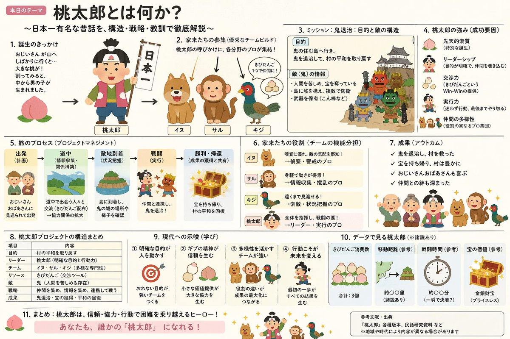 | 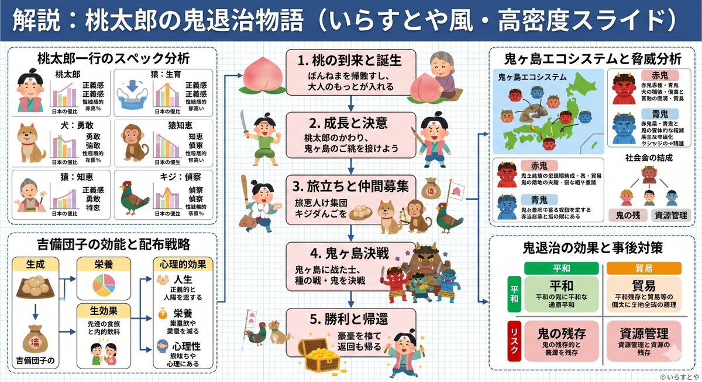 |
|  |  |

Source: [Tweet](https://x.com/yammamon/status/2045778624092254603)  
Title: **Create an explanatory slide ({argument name="format" default="ponchi-e diagram"}...**  
**Prompt**
```text
Create an explanatory slide ({argument name="format" default="ponchi-e diagram"}) for {argument name="theme" default="Momotaro"} that fuses the gentle atmosphere of "Irasutoya" with the overwhelming information density of "Kasumigaseki slides".
```

 
| Preview 1 | Preview 2 |
|---|---|
|  |  |
|  |  |

Source: [Tweet](https://x.com/Kurt_Rousey466/status/2046267707881029934)  
Title: **Help me create a detailed production flowchart for the dish {argument name="dish...**  
**Prompt**
```text
create a detailed production flowchart for the dish {argument name="dish name" default="Fried Pork with Chili"}, in a realistic style, suitable for Xiaohongshu image-text proportions.
```

 
| Preview 1 | Preview 2 |
|---|---|
|  |  |
|  |  |

Source: [Tweet](https://x.com/hx831126/status/2046448092871041500#reversed-2)  
Title: **{**  
**Prompt**
```text
"title": "文件生成、显示与存储 FILE OUTPUT, PREVIEW, STORAGE",
```

  
| Preview 1 | Preview 2 |
|---|---|
|  |  |
|  |  |

Source: [Tweet](https://x.com/MrLarus/status/2046263153546174935)  
Title: **Please generate a high-design character relationship map poster based on {argume...**  
**Prompt**
```text
generate a high-design character relationship map poster based on {argument name="theme" default="Demon Slayer"}. This image should not be a simple illustration, but a character relationship map that combines information visualization, narrative structure, poster design sense, and stylistic fidelity.

Please automatically complete the following:
- Identify the work and core settings corresponding to the theme
- Extract the most representative 6–12 key characters, not exceeding 15 if necessary
- Identify and display key character relationships, including blood ties, romance, friendship, alliances, hostility, master-disciple, etc.
- Automatically choose a composition method based on the work's characteristics, such as protagonist-centered, dual-core confrontation, faction-based, family tree, or chronological evolution
- Automatically refine the work's style DNA, including color, worldview symbols, textures, mood, typography, and representative elements
- Transform these stylistic elements into an overall visual design for the relationship map, rather than simply copying an official poster
- Use different colors, line types, and arrows to distinguish different relationships, ensuring clear lines and layers without clutter
- Make core characters most prominent, followed by important characters, and subordinate characters weakened to form a clear visual hierarchy
- Ensure every character name is legible, with identity or faction labels if necessary

The final product should satisfy:
- Immediate understanding of character hierarchy and key relationships
- Obvious alignment with the original work's temperament and setting
- Combines the clarity of an infographic with the premium design of a poster
- Unified, exquisite, complete, and suitable for social media sharing or poster display
- Avoids a cheap flowchart feel, messy piling, and information overload.
```

## Product & Marketing

2 prompt examples in this category.  
[Open doc](docs/product-marketing.md)


Source: [Tweet](https://opennana.com/awesome-prompt-gallery/terminator-taobao-page)  
Title: **Generate image:**  
**Prompt**
```text
Generate image:
Taobao product detail page of a T-800 robot, showing:
front, side, and back three-view drawings of the robot,
product price,
product details,
functions and usage scenarios
```

 
| Preview 1 | Preview 2 |
|---|---|
| 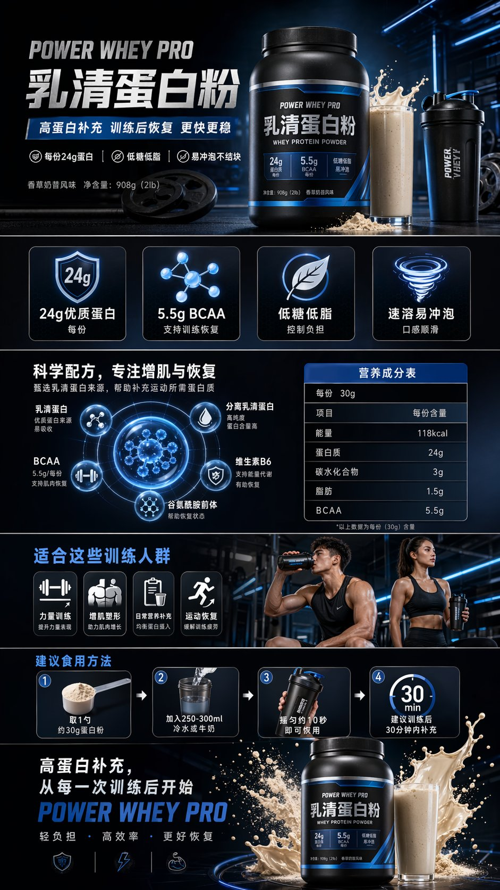 |  |
|  | 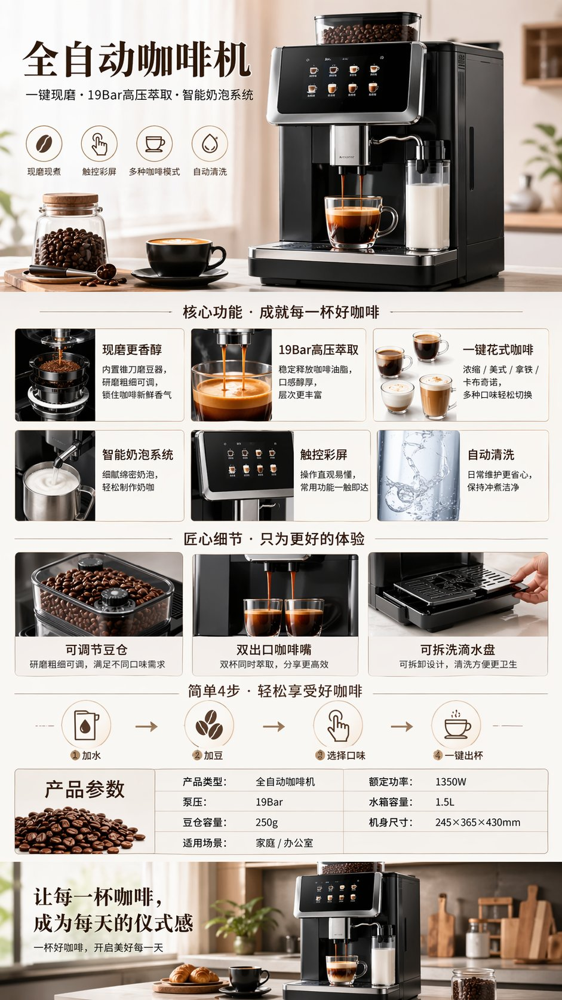 |

Source: [Tweet](https://x.com/MrLarus/status/2046627021674168640)  
Title: **Generate an e-commerce product detail page for [product name]**  
**Prompt**
```text
Generate an e-commerce product detail page for [product name]
```

## Comparison & Benchmark

1 prompt examples in this category.  
[Open doc](docs/comparison-benchmark.md)

 
| Preview 1 | Preview 2 |
|---|---|
| 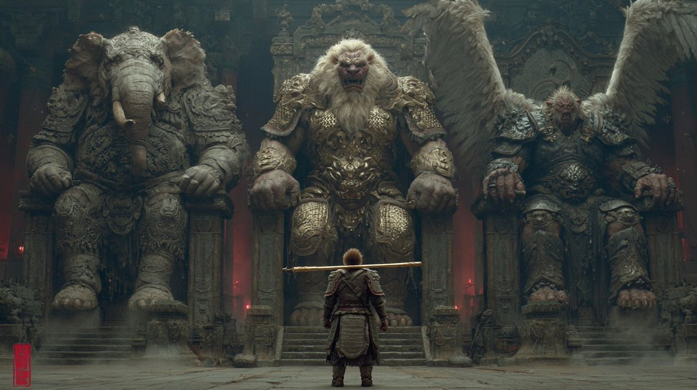 | 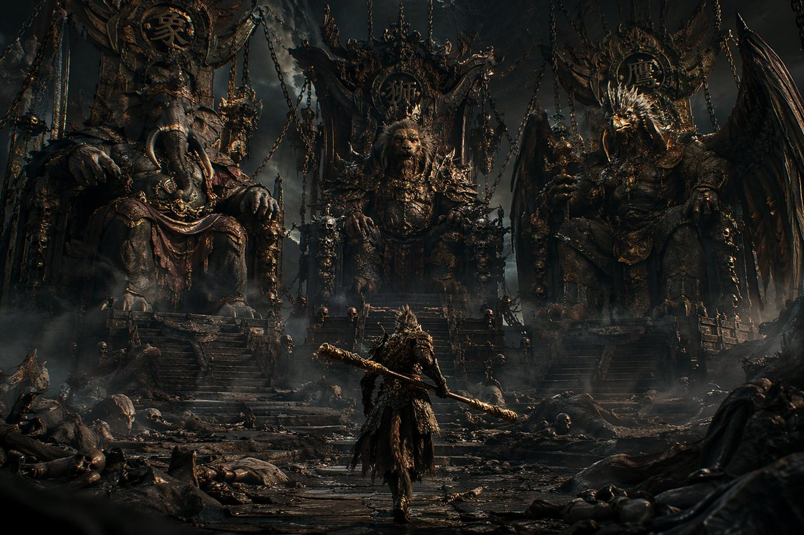 |

Source: [Tweet](https://twitter.com/MANISH1027512/status/2045743158860878312)  
Title: **MJ v8.1 vs GPT Image 2**  
**Prompt**
```text
中式怪异，黑暗神秘风格融合中式美学，完美细节，多重管线渲染，完美建模。西游记背景，狮驼岭，千妖万怪，坐在左边巨大王座上的大象王重甲妖精，坐在中间巨大王座上的狮王重甲妖精，坐在右边巨大王座上大鹏鸟王重甲妖精。渺小的背对镜头孙悟空肩抗金箍棒步行前进，孙悟空身穿铠甲，近地仰拍镜头，长焦镜头，强烈阴影。极致细节刻画，多次修改，正确透视和主体线条，精致细节
```

## Maps, Cards & Structured Layouts

11 prompt examples in this category.  
[Open doc](docs/maps-cards-layouts.md)


| Preview |
|---|
|  |

Source: [Tweet](https://twitter.com/Malek1173989/status/2045836887684694395)  
Title: **Is this gpt image 2?**  
**Prompt**
```text
"Sam Altman on a skateboard at a skatepark with no people."
```

 

Source: [Tweet](https://raw.githubusercontent.com/ZeroLu/awesome-gpt-image/main/README.md)  
Title: **Generate a high-fidelity mobile e-commerce app homepage screenshot inspired by m...**  
**Prompt**
```text
Generate a high-fidelity mobile e-commerce app homepage screenshot inspired by mainstream Chinese e-commerce apps in 2026. The interface should look fully realistic, with complete mobile-app UI logic and strong commercial design polish.

Layout requirements:
- status bar with time 9:41, 5G signal, and battery icon
- search area with a city selector on the left, a rounded search box in the center, and message plus scan icons on the right
- horizontal category tabs below the search area
- top promotional carousel banner
- 10-icon function grid
- flash-sale module with countdown and three product cards
- "guess you like" two-column product waterfall with at least 6 product cards
- bottom tab bar with five tabs

Use these exact Chinese labels where appropriate:
- city: "杭州"
- search placeholder: "搜索耳机、咖啡机、运动鞋"
- category tabs: "推荐、数码、家电、服饰、美妆、食品、运动、家居"
- top banner: "618 预售开启" and "每满300减50"
- function grid: "超市、百亿补贴、秒杀、直播、充值中心、到家、领券、品牌馆、全球购、排行榜"
- flash sale title: "限时秒杀"
- recommendation section: "猜你喜欢"
- bottom tabs: "首页、分类、购物车、消息、我的"

All Chinese text must be clear and readable with realistic fonts. Spacing, icon style, white space, shadows, rounded corners, dividers, and tag treatments should closely resemble a real app screenshot rather than concept art.
```


Source: [Tweet](https://opennana.com/awesome-prompt-gallery/custom-style-ui-system)  
Title: **Generate a UI design system for me in xx style, including web pages, mobile, car...**  
**Prompt**
```text
Generate a UI design system for me in xx style, including web pages, mobile, cards, controls, buttons, and others
```

 

Source: [Tweet](https://raw.githubusercontent.com/ZeroLu/awesome-gpt-image/main/README.md)  
Title: **Create a Chinese infographic poster themed "一杯咖啡 如何来到你手里" ("How a Cup of Coffee ...**  
**Prompt**
```text
Create a Chinese infographic poster themed "一杯咖啡 如何来到你手里" ("How a Cup of Coffee Reaches You"). Use a premium information-design style with both educational clarity and commercial appeal. The layout should include directional flow, arrows, data boxes, icons, simple illustrations, and modular cards. Use coffee brown, milk white, ink black, and copper accents.

The infographic must include:
- 01 Planting: elevation 1200-2200m, suitable temperature 18-24C, picking season Nov-March
- 02 Processing: sun-dried, washed, honey process
- 03 Roasting: light roast = brighter, medium roast = balanced, dark roast = richer
- 04 Grinding: pour-over = coarse, espresso = fine, cold brew = medium-coarse
- 05 Extraction: powder-water ratio, water temperature, and time all affect flavor
- flavor keywords: floral / citrus / nutty / caramel / chocolate / smoky

Use this exact fine print:
"适合用于咖啡入门科普与门店展示"

The composition should balance text and visuals while keeping the design elegant. Focus on long infographic handling, numeric information, temperatures, numbered sections, concise descriptions, slash-separated flavor words, and modular layout. It should look like a premium display board, not a classroom slide deck.
```

  
| Preview 1 | Preview 2 |
|---|---|
| 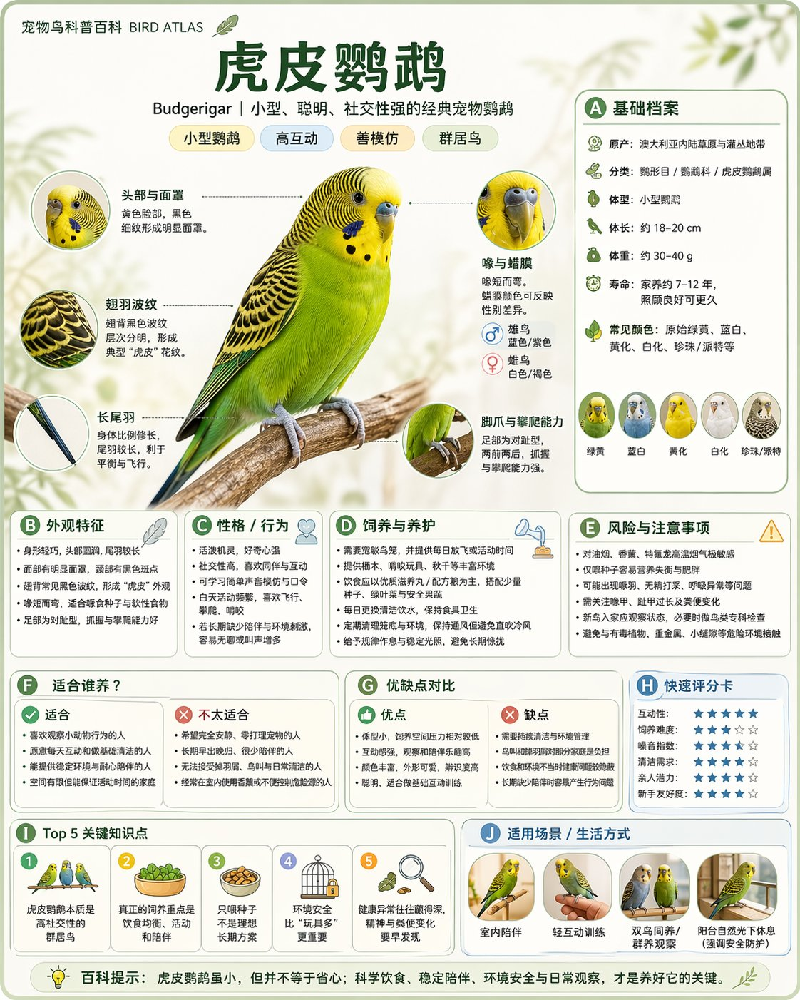 |  |
| 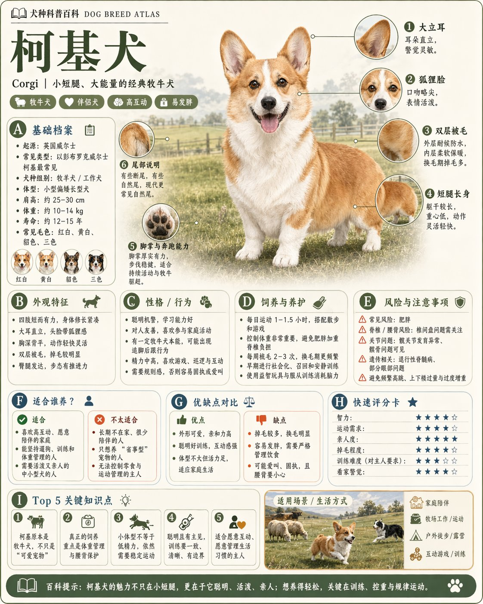 | 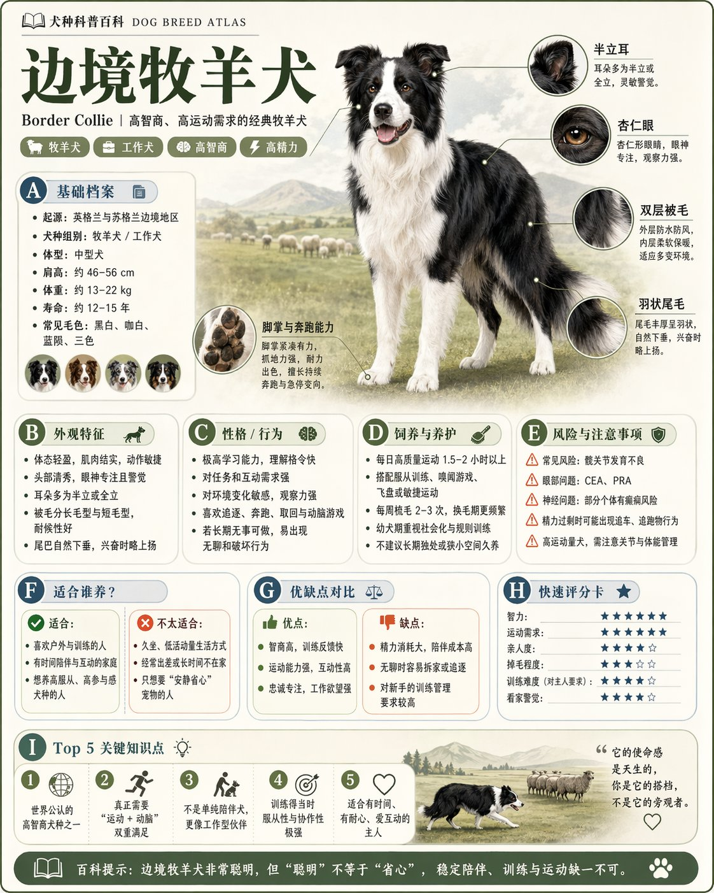 |

Source: [Tweet](https://x.com/MrLarus/status/2046627021674168640)  
Title: **Generate a high-quality vertical encyclopedia-style infographic for [topic].**  
**Prompt**
```text
Generate a high-quality vertical encyclopedia-style infographic for [topic].

This should not be a normal poster or a simple illustration. It should feel like a modular educational infographic that combines the clarity of a field guide, the structure of an encyclopedia page, the polish of a lifestyle knowledge card, and the shareability of a strong social-media explainer.

The image should include:
- a clear and appealing main visual of the topic
- several enlarged detail callouts
- multiple rounded modular information sections
- strong title hierarchy and highlighted key labels
- concise but information-rich educational content
- visual scoring, quick takeaways, or a Top 5 module

Adapt the content sections automatically based on the topic. Useful categories include:
basic profile, classification, appearance, habits or ecology, formation mechanism or structure, growth or usage conditions, care or maintenance advice, risks and cautions, suitable users or use cases, pros and cons, and a quick scorecard.

Visual requirements:
use a clean light background, soft colors, subtle shadows, refined small icons, rounded information cards, and neat layout. The information density should be high but not crowded, and the final image should feel publishable, collectible, and repeatable as a knowledge-card format rather than an advertisement.

Do not make it look like a commercial promo poster. Emphasize knowledge organization, modular information, and a field-guide presentation.
```


| Preview |
|---|
| 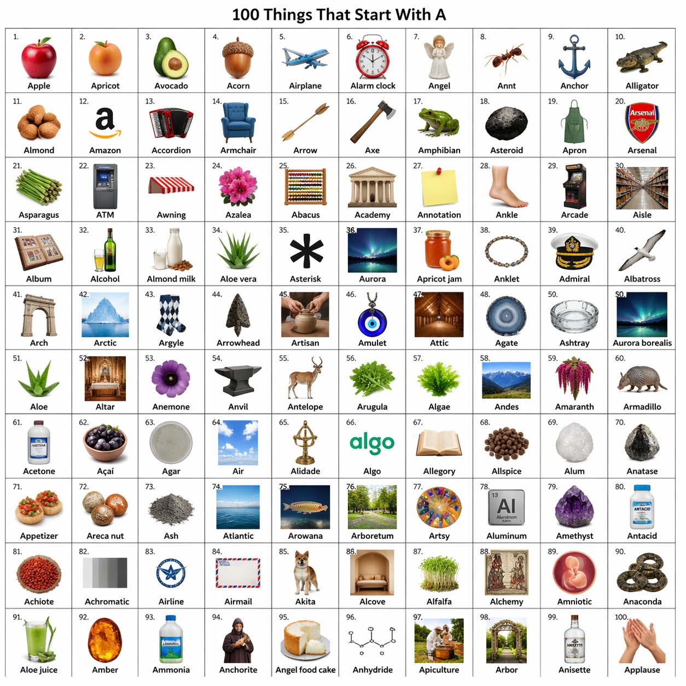 |

Source: [Tweet](https://x.com/umesh_ai/status/2046510988367945983)  
Title: **Create an image with a 10x10 grid of objects whose names all start with the lett...**  
**Prompt**
```text
Create an image with a 10x10 grid of objects whose names all start with the letter A
```

  
| Preview 1 | Preview 2 |
|---|---|
|  |  |
|  |  |

Source: [Tweet](https://x.com/MrLarus/status/2046627021674168640)  
Title: **Generate a Chinese fitness infographic for [topic].**  
**Prompt**
```text
Generate a Chinese fitness infographic for [topic].

The graphic should be both professional and practical for a normal adult to use as a training reference. Unless otherwise specified, assume the audience is a healthy adult with no major injuries, the goal is muscle gain plus basic strength improvement, the level is beginner to intermediate, the setting is a normal gym, and the total session length should stay within 40 to 60 minutes.

Choose the output format automatically based on the training topic:

1. If the topic is a muscle group or body part, such as chest, lats, biceps, abs, shoulders, or legs, generate a training-plan infographic for that body part.
2. If the topic is an exercise or skill goal, such as pull-up, push-up, dips, or squat, generate an exercise-unlock or progression-plan infographic.

Use a clear, modern, professional, easy-to-read Chinese infographic style in vertical format. The visual design should be clean and suitable for social sharing or personal training reference. Do not write long paragraphs. Each module should use short concise phrases, and numerical information should be prominent.

The infographic must include:
A. Title area with main title and subtitle
B. Training goal area
C. Warm-up area
D. Main training area with 4 to 6 core exercises
E. Progression or unlock logic area
F. Alternative exercises area
G. Execution reminders area
H. Recovery suggestions area
I. Visual design requirements: modern, clean, professional, modular card layout

The final result should be a complete infographic rather than plain text paragraphs.
```

  
| Preview 1 | Preview 2 |
|---|---|
|  |  |
|  |  |

Source: [Tweet](https://x.com/alanlovelq/status/2046378199681257920)  
Title: **Please generate a high-quality vertical "Popular Science Encyclopedia Image" bas...**  
**Prompt**
```text
generate a high-quality vertical "Popular Science Encyclopedia Image" based on {argument name="theme" default="animals"}.

This image is not a regular poster or a simple illustration, but a modular popular science infographic that possesses a sense of "illustration book, encyclopedia, information structure, and collectability." The overall style should reference a combination of high-end natural history illustrations, modern encyclopedia pages, lifestyle knowledge cards, and highly shareable social media infographics.

Please include in the frame:
- A clear and beautiful main visual of the subject
- Several magnified details of local characteristics
- Multiple rounded modular information sections
- Clear title hierarchies and key labels
- Concise yet rich encyclopedic content
- Visual ratings, key point summaries, or Top 5 modules

Content columns should be automatically adapted based on the theme, prioritized from these directions: basic profile, classification information, appearance characteristics, habits/ecology, formation mechanism/structure, growth or use conditions, care or maintenance suggestions, risks and precautions, suitable audience or scenarios, pros and cons comparison, and quick rating cards.

Visual requirements:
Light-colored clean background, soft color palette, light shadows, exquisite small icons, rounded information boxes, neat layout, high information density but not crowded, good reading experience. The overall result must look like a real science encyclopedia card suitable for publishing, reading, collecting, and serialized production, rather than an advertisement.

Please do not make it a regular commercial promotional poster. Highlight the features of "knowledge organization + modular information + illustration-style display."
```

 
| Preview 1 | Preview 2 |
|---|---|
|  |  |
|  |  |

Source: [Tweet](https://x.com/maxescu/status/2045036186734039545)  
Title: **Search the web for {argument name="performance description" default="this week’s...**  
**Prompt**
```text
generate a {argument name="card type" default="Highlight card"}.
```

 
| Preview 1 | Preview 2 |
|---|---|
|  |  |

Source: [Tweet](https://x.com/songguoxiansen/status/2046476566537080849)  
Title: **Generate a 12-grid card image of the 12 Golden Saints from Saint Seiya, with eac...**  
**Prompt**
```text
Generate a 12-grid card image of the 12 Golden Saints from Saint Seiya, with each card featuring its corresponding Chinese name, 4 cards per row, in a 16:9 aspect ratio.
```

 
| Preview 1 | Preview 2 |
|---|---|
|  |  |
|  |  |

Source: [Tweet](https://x.com/IndieDevHailey/status/2044974254769463312#reversed-0)  
Title: **{**  
**Prompt**
```text
"headline": "{argument name=\"hero headline\" default=\"How We Created 10M+ Viral Impact\"}",
```
